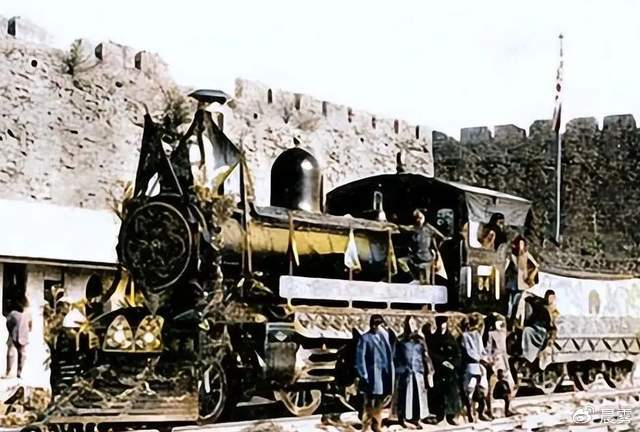
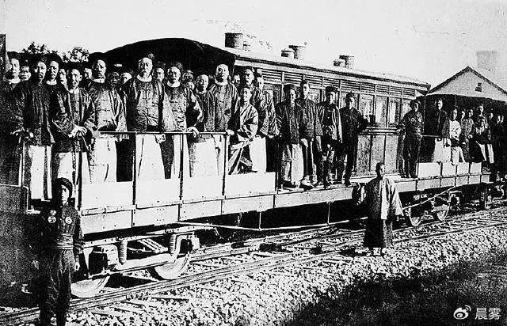
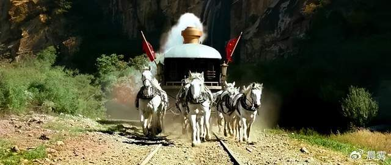

——从张维为的“祖上曾阔过”到余姓女的“外交豁免权”

那一年，慈禧终于勉强同意了李莲英的建议，准允李鸿章铺了一条铁轨，而英国人的火车也由大船运抵天津港然后运抵帝都。当李莲英要慈禧去看看这个玩意的时候，慈禧大怒，特么的英国毛子进贡的东西，怎么不给哀家拿到宫里来，要让哀家屈尊出宫去看？

李莲英连忙回答：洋人的东西都很大，大到进不来……

他知道慈禧不是武则天。

慈禧很不情愿地出宫到了火车停放的地方：果然很大！

看见一些人先上了车，她又不高兴了，怎么能够有人先于哀家上车呢？英国人连忙解释说这些是给老佛爷服务的，他们先上去安排这样、安排那样，比如泡一杯red tea之类。

最让慈禧不高兴的是，火车司机居然是站着开车，当即命令他跪下。司机一脸苦逼：火车是可以跪着开的么？

而且，慈禧还要求随车人员必须都是太监。这一要求一提出来，吓得同车的英国佬个个夹紧双腿，一股寒意升腾起来。他们害怕这老女人一时兴起，真的把他们骟了！

坐了一段路，慈禧受不了轰隆隆的声音，她很不满意！不满意粗笨、不满意浓烟、不满意居然有人站着、不满意喧闹……然后，她给这火车指明了一条改进的方向：把火车头拆了，改用马拉！

马拉火车，后来在姜文的《让子弹飞》里得到了具体的体现，而且吃着火锅唱着歌……

有人问什么才是阻碍科学发明的最大障碍？回答五花八门，其中一个回答得到大家的认可。回答是这样的：如果能够组织十万人去修长城，还有什么必要发明推土机？可以动用成千上万的人去挖运河，还有什么必要发明挖掘机？可以住在避暑山庄，由几十人帮忙打扇子扇风纳凉，还有什么必要发明空调？可以由八人、十六人抬着轿子出行，还有什么必要发明汽车……

慈禧问大家：我们有马，还有什么必要引进火车？若论起马车来，那是咱战国时期就已经出现的出行标配了，而多年以后外国人发明蒸汽机以及火车，不过是0-1的突破而已！你想反过来压祖宗么？

这话有点像张维为的腔调。

写到张维为，我首先要申明一下，作为一个复旦毕业生，当然是不认可他是复旦教授的，我读书那时候，苏步青教授还在，谢希德教授当校长，没有张维为这样的怪物。

张维为在回答学生关于近200年中国没有贡献什么重大的现代科技发明时说，现在西方这些东西，是我们祖宗几百年前甚至上千年以前就奠定了的基础……

其实这话用不着这么绕，他只需要像Q哥一样回答“我祖上比你阔多了”就行了！文化自信可以一下子就过渡到科技自信，就这么简单！

其实这个问题早在1980年代就讨论过了，比如罗盘在这里只能看风水，但指南针则催生了大航海时代，火药只能在这里变成烟花，而人家搞出了热兵器……等等之类，你总不能一边在坟地看风水一边鄙视人家的大航海吧？就进化史来看，有些猴子进化成了人类，另一些则没有进化，那么那些没有进化的猴子是不是可以就此而看不起人类，甚至还可以说特么的人类不过是我的一些亲戚进化出来的……

因此我们有理由认为，张维为看起来像人，其实他的心还陶醉在猴子阶段！不过他的猴命很好，甚至可以说是生逢其时，恰好身处沐猴而冠的大好时代，

张维为的言论已经成为一个时代的文化底色和理论支撑，所有关于民族主义和文化自豪的表演，都可以在张维为的言论中找到源头，正向的遥遥领先以及负向的U型锁都拜张维为辈（当然不止他一个）所赐，而四方来朝的伟大梦想正在提升着张维为的价值，自嗨与他嗨相结合的伟大工程就此得以完美收官！

张维为可能已经忘记了，某地曾经想催生一百个乔布斯，人们似乎也曾讨论过为什么这里没有马斯克而只有杰克马，虽然最后没有什么结果，但问题既然已经提出来，就意味着有些梦想还是围绕着现代科技展开的，并不是所有的人都扛着祖上阔多了的牌子混日子的。问题在于，正如芯片梦一样，关于科技的梦想其实也有可能被特权或者骗子干掉！

这是另一个问题。比如杰克马变成马斯克，某地真的催生出了一千个乔布斯，那么马斯克的星舰是干什么用的呢？星链，那个可恶的星链到底是星链呢还是星的长城？至于那一千个乔布斯，他们是说重新定义了手机呢还是自称遥遥？

一个中国人，可以在中国驾驶使馆车，在中国乱停车，还声称享有外交豁免权，这么拗口的事情都做得出来，这个比反美是工作，赴美是生活更加奇葩了。你享有特权我们都知道，但你一个国人在国内居然还享有外交豁免权，这就超过张维为了，张维为不过只有一个瑞士永居权而已，他虽然可以随时抛弃曾经阔过的祖宗，但也不至于嚣张到高喊我是外国人，我有豁免权的……在网上没有查到张维为交通违章的记录。

余姓女的嚣张，是慈禧跋扈的进化。如果说慈禧霸凌的是英国的火车司机以及可以享有外交豁免权的英国人，余姓女则是直接向同胞撒泼了，她深知这深厚的中世纪土壤里长满了韭菜与葱子，她是镰刀，所以那么轻轻一挥，我们就纷纷倒下。人们都在扒拉余姓女的真实身份，但这实在是没有必要的事情，因为在我看来，她的身份越是模糊就越是真切。我敢打赌，她一定曾经是人民公仆，只有经过公仆系列课程的严格训练，她才会如此出色。

高喊祖上阔过的张维为，一定看不见不再阔的问题。当然也不会认为余姓女这样的跋扈有什么问题。大家都知道，张维为的一切努力，不就是围着余姓女们的需求展开的么？正如李莲英的努力，不就是围着慈禧转么？慈禧可以让马拉火车，张维为当然可以论述出马拉的独特好处，定然也会写出诸如“红肿之处艳若桃花”的佳句来……
