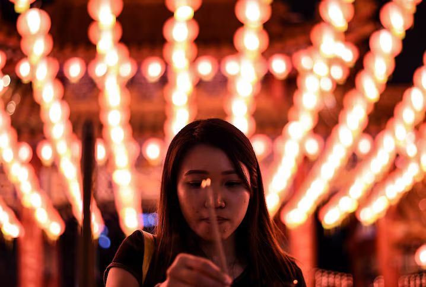
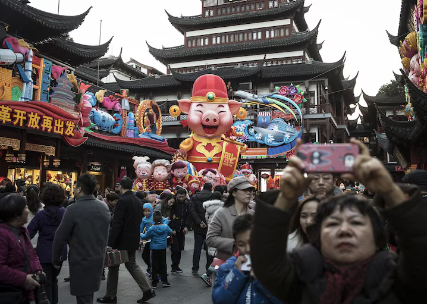
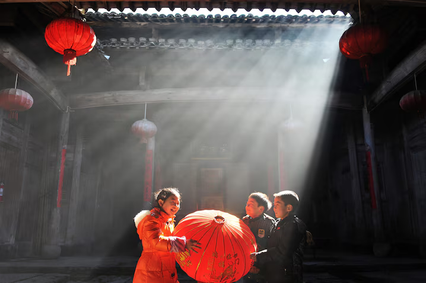
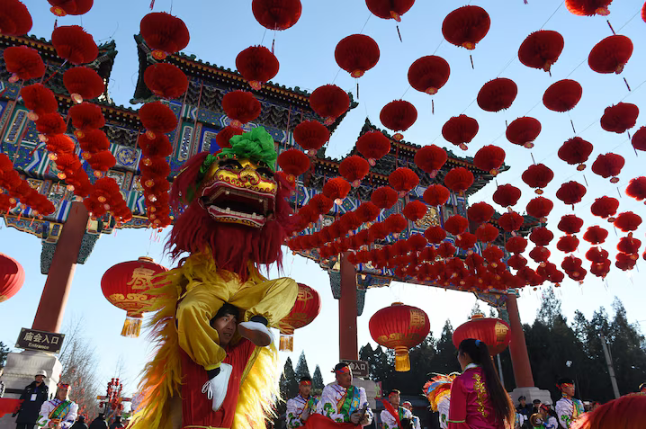

BySophie Friedman - National Geographic

Lunar New Year is a festival **_beyond compare_**[1](#65d07cfc-a0b0-4f24-8b8b-50e33c2ebe44). **_Technically_**[2](#ab598883-1b55-4570-a362-dae20c45bcc4) it’s a week—determined by the lunar calendar but always late January to mid-February—but for many, Chunjie(Spring Festival) is more like 40 days of celebrations. _**The travel involved**_[3](#77a3ef7f-4998-4684-8d1c-b5614386e0b2) has been called the largest annual human migration in the entire world. China holds 1.4 billion people (18.4 percent of the world’s total population, but **_who’s counting?_**[4](#cee0e29e-979c-4ff6-b1c0-56e34e89a3ea)) and every year, nearly three billion people **_fan across the country_**[5](#3b60753c-dcf1-40e7-bac6-fd6415b76f28), returning to their hometowns. Here are 10 essential things to know about this massive, annual event.

## **Name that holiday**

The holiday is not celebrated just in mainland [China](https://www.nationalgeographic.com/travel/destination/china) and Hong Kong. For Chinese people, Lunar New Year is the Spring Festival, and it’s celebrated widely in Taiwan and across Southeast Asia in countries with large Chinese populations, such as [Singapore](https://www.nationalgeographic.com/travel/destination/singapore) and [Malaysia](https://www.nationalgeographic.com/travel/destination/malaysia). In [Korea](https://www.nationalgeographic.com/travel/destination/south-korea), the Lunar New Year is called Seollal; in [Vietnam](https://www.nationalgeographic.com/travel/destination/vietnam), Tet; and in Tibet, Losar.

## **Say “Happy New Year!”**

In Mandarin, they’ll say gong _xi fa cai_ (恭喜发财), wishing you a **_prosperous_**[6](#712ccd36-77b4-4cb4-ada6-da49d53cb91d) New Year. In Cantonese, it’s _gong hey fat choi_. Still, if you wish someone x_in nian kuai le_ (新年快乐), literally "Happy New Year," that’s perfectly welcome, too.

## **Hear firecrackers**[7](#ae921fca-a387-4b2e-831e-0155f2826d60) **popping**

**_Leading up to_**[8](#d4a5961e-6527-4ece-8771-25594bb81d38) and during the Spring Festival, the streets of Chinese cities used to sound like war zones, with firecrackers exploding all night. Following a big **_clampdown_**[9](#a92f796d-3ba1-4b0d-9019-b71f8b479c15) on people setting off their fireworks in urban areas, you’ll most likely only hear these sounds in smaller towns and the countryside. The firecrackers serve two purposes: One, they’re fun and celebratory; two, they were traditionally set off to scare away dragon-lion monster Nian_—_who, as legend has it, would attack villagers and sometimes eat children but could be frightened off by loud noises.

## **Read _the Chinese Zodiac signs_**[10](#d682abc4-1f22-4ba4-8df6-af2695671536)

This year is the Year of the Snake. There are twelve Chinese Zodiac signs, and these are taken far more seriously than a back-of-tabloid horoscope. Some signs, like the dragon, are **_coveted_**[11](#fffc61df-3d64-42aa-b782-6af6f119aba2) because dragons are considered authoritative, strong, and successful. Couples will aim to have babies in dragon years. Certain signs are said to match well with others: Dog (**_sincere_**[12](#3a445a0f-e022-4776-ac43-7553757bdf5c), loyal, independent) and Rabbit (sensitive, **_modest_**[13](#36e8263e-95a9-4ff7-8673-859544700437), warm) are considered good pairings. Your sign is determined by birth year—using the lunar calendar—so if you were born between February 17, 1988, and February 5, 1989, you’re a dragon. You would think your Zodiac year (_benming nian_, 本命年) would be lucky, but it’s the opposite. You’ll need to watch out for and ward off bad luck.

## **See red everywhere**

In traditional and contemporary Chinese culture, [red](https://www.nationalgeographic.com/photography/article/life-color-red) represents prosperity and happiness. It’s considered a lucky color, and people will wear it in celebration to **_usher in_** an **_auspicious_** new year and to keep away bad **_vibes_**[14](#64af8809-475e-4fd2-96a4-c0620a745dee). Jumpsuits, sweaters, trousers, scarves, socks, hats, anything is game. If it’s your Zodiac year you should wear more red than others, to **_buffer_** yourself **_from_**[15](#81d2b82d-20c3-4689-9b24-7ed5bdf3f061) misfortune. In addition to being scared of loud noise, monster Nian fears the color red. So, maybe red’s not your favorite color, or perhaps you want to be protected closely every day. That’s where red underwear becomes useful. Go into any department store from December through February, or stop at one of the many **_street stalls_**[16](#4b7b7d8c-4335-4852-a1d8-245094b660ea) selling socks and underwear, and you’ll see pair after pair of red.

## **Decorate for good fortune**

Walk around older neighborhoods in any Chinese city (or the countryside) and see peoples’ windows, walls, and doors **_adorned_**[17](#7a121663-5255-4bbb-b62e-958d95586b32). Squares of red paper with white characters like 福 (_fú_, good fortune) are **_pasted up diagonally_**[18](#c1c0ab65-69f1-415e-915a-e8a8509d8086). Red paper cuttings **_get taped_**[19](#8877c1f0-b548-4265-9a74-e7ac32b6a04e) onto windows so that passersby can admire them, and red banners (two vertical, with an optional third hanging horizontally) showcase Spring Festival couplets in gold. Likewise, in older neighborhoods, it’s not uncommon to see huge salt-cured fish hanging from power lines, drying next to the **_laundry_**[20](#de45f35b-9be6-42c4-ad5e-65137a21396d). Symbolizing prosperity, fish is a must for Lunar New Year. Fish (鱼, _yu_) is a **_homonym_**[21](#e69bf546-62df-4e31-aa1a-d089ea1bbc48) of 余 (_yu_), meaning surplus or extra. In public buildings like offices, hotels, and malls, visitors will notice tasseled, red-paper lanterns **_strung up_**[22](#b5e9e975-411e-4a55-9967-a940fd46740f), and kumquat trees positioned for good luck and wealth. In Mandarin, a kumquat is called _jinju_ (金橘), and _jin_ (金) is the word for gold.

## **Exchange envelopes**

_Hongbao_ (红包), literally "red packet," is a key element of Lunar New Year. The cash inside is considered lucky money for the upcoming year. Hongbao is generally given by elders to the younger generations, especially children, but if you earn well, it’s polite to share it with your parents and grandparents this time of year. If you’re married, you must give hongbao; if you’re single, you usually receive it. If invited to someone’s house for Lunar New Year and you know they have kids, it’s nice to put some cash into a hongbao. If you’re traveling in the north, go for a round number; in the south, use lucky numbers (anything with six or eight). Don’t give a multiple of four; the number is a homonym for death.

## **Cut hair early**

It’s nice to enter a new year without split ends, but for many people celebrating Spring Festival, it’s more than that. Before midnight on New Year’s Day, **_hair salons_**[23](#10d274e2-8f09-4c1a-9279-e39deebfd9ce) are abuzz with revelers, wishing to cut away last year’s bad luck and walk out with a clean, shiny slate. Then it’s no washing for 24 hours, to avoid scrubbing away the good luck.

## **Join the fun**

Spring Festival is mostly celebrated at home, with family. Restaurants are closed, but leading up to the New Year, tuck into heaping plates of dumplings (饺子, _jiao zi_)—which sounds like 交子 (_jiāo zi_); the second symbol, 交 (_jiao_) means "exchange”, 子(_zi_) is an abbreviation for 11 p.m to 1 a.m. So put together, you’re exchanging the old year for the new with pillowy pockets of dough. With the ban on fireworks in cities, you won’t be shooting off pop rockets (your ears will thank you). Short of inviting yourself to someone’s house for dinner, the best bet for participating is at fairs inside temples in [Beijing](https://www.nationalgeographic.com/travel/destination/beijing). The largest takes place at [Ditan Park](https://www.tripadvisor.com/Attraction_Review-g294212-d1372938-Reviews-Ditan_Park-Beijing.html), where a canopy of red lanterns is strung overhead and performances are held daily: Tibetan folk dancing, a reenactment of the imperial family’s traditional harvest prayers, and magic shows entertain all ages. Handicrafts are for sale, including snacks like _niangao_ (the holiday glutinous rice square) and _jiaoquan_ (a savory cruller best dipped in _doujiang,_ or fresh soy milk).
