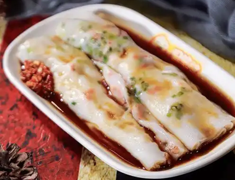
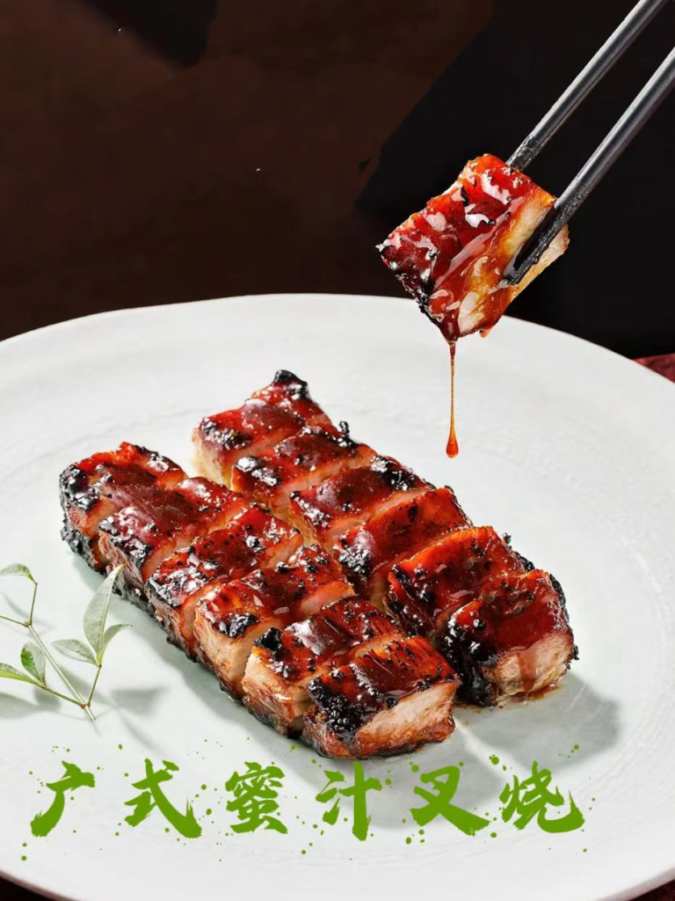
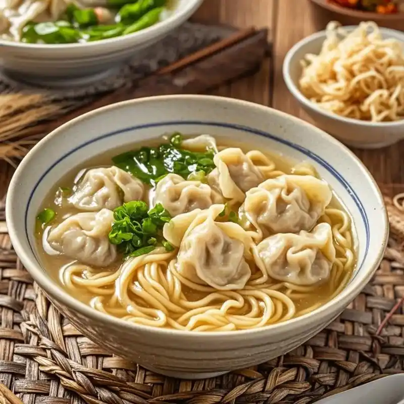

By ArChan Chan - National Geographic

Food is an integral part of any culture, and that’s certainly the case in Hong Kong. While its **_cuisine_**[1](#ca2ea6e7-8d1c-49c7-9c52-190645f888f9) is strongly influenced by its Chinese roots, it also reflects the city’s cultural diversity and rich history — from its time as a British **_colony_**[2](#a417aa5e-f934-4c7b-880f-36b3af6ac203) to its current status as a **_cosmopolitan metropolis_**[3](#84ae9569-0d7f-49b1-a4e6-29128c6f1e6c).

There are four common types of **_carbohydrate_**[4](#c70cf650-186b-415e-a17c-b2ed30635457): juk (congee), fun (rice noodles), mein (wheat noodles) and fan (rice). Congee is mainly eaten as a breakfast food, as is cheung fun (plain rice noodle rolls with **_sesame sauce_**[5](#65432a67-2c9c-48e4-b36a-d36ef1ab966e) and _**sweet soy sauce**_[6](#93396a06-f055-4cf0-8d78-d4f0ff7f9d84)). But locals also enjoy a **_leisurely_**[7](#32d8bd7c-92f0-4ad8-8f96-f6bc374d3fd6) yum cha (brunch with tea) of dim sum.

For Canto-Western cuisine, visit a cha chaan teng. These British colony-era cafes are known for their good-value set **_menus_**[8](#60885648-7d39-4b98-8f12-2f64c24fc5e5) and simple food, such as ham and **_macaroni_**[9](#814a5f32-a9eb-4bbf-b77c-3058d668725f) soup, and satay beef with instant noodles. Wash it down with a cup of Hong Kong’s **_signature_**[10](#5a50f7a0-37d0-4479-8dcf-105c6045f70b) milk tea.

For lunch, noodles are a favourite. Wonton mein (wonton noodles), ngau lam mein (braised beef brisket noodles) and che jai mein (**_cart noodles_**[11](#36a5daab-d5df-4a09-8786-164a8df40fa0)) are among the most popular. While lunch is usually a quick solo affair, dinner is all about getting together with family and friends. **_Hotpot_**[12](#567b2127-fd16-4fac-8686-fdaa6b86b846) is great for this, with diners dropping **_raw ingredients_**[13](#76a09362-42bb-49d2-8715-23349e2910d3) — fish balls, vegetables, **_beef slices_**[14](#500e38f3-ebe8-4477-a0e4-526897d98503), seafood — into a soup base flavoured with ingredients such as pork bones, tomato, fish or mushrooms.

There aren’t just three meals a day, however — late-night supper is known as siu yeh and is an essential way to **_unwind_**[15](#7ea6073e-6526-449c-8685-c2ff183ebd1f) after a long workday. Afternoon snacks **_abound_**[16](#4c003a4f-a31b-488d-bcb0-def483b9e29e), too, with street foods such as curry fish balls and **_fake shark fin soup_**[17](#dd8cd736-4662-489e-a545-37dd87dd4698).

As for sweet things, Hongkongers like these at all times of the day, but especially at night. Chewy, **_glutinous rice balls_**[18](#b17186e0-7581-4386-91d2-b4c32042d99b), **_taro balls_**[19](#b03cb02b-79f1-4dff-812d-8079c56db7ca) and **_sago (tapioca)_** [20](#02d7d4d4-ca62-4153-9805-35ab0102eb79)are popular, as is **_shaved ice_**[21](#5a6584fc-0915-45e5-95a7-14bd51a4e59d) with red (adzuki) bean and **_condensed milk_**[22](#139ff40b-c814-424e-86ae-f3ea64bb97d5).

## **Must-try dishes in Hong Kong**

**1. Gaibo**  
Unique to Hong Kong, this dish (also known as chicken pot) is two in one. You start with chicken in a **_clay pot_**[23](#42c0b545-9487-4cb7-b817-0cb7c78ec0df) with spicy mala sauce; once most or all of the meat has been eaten, soup is added. Diners can then order raw ingredients to cook in it, hotpot-style.

**2. Char siu**  
Whether eaten as a simple everyday meal or finely prepared in a restaurant, this roast meat is **_arguably_** [24](#6645ea8e-849a-4be0-b6f8-062c1016a77c)one of Hong Kong’s most loved. A rich **_marinade_**[25](#d72d228e-beb7-491c-b649-7dd56977f4e0) gives the pork a savoury and complex flavour, while a caramelised maltose glaze adds pleasant sweetness and charred notes.

**3. Wonton noodles**  
The noodles in this dish are made of **_flour_** [26](#84eb0d9a-1335-4d53-83eb-d80c6b3b834c)and alkaline water — resulting in a bouncy texture — and served in a delicate, clear broth of dried flounder and yellow chives. Some places stick to traditional small wontons, while others add big ones with shrimp. It’s best enjoyed with a splash of red vinegar to balance the alkaline flavour.

