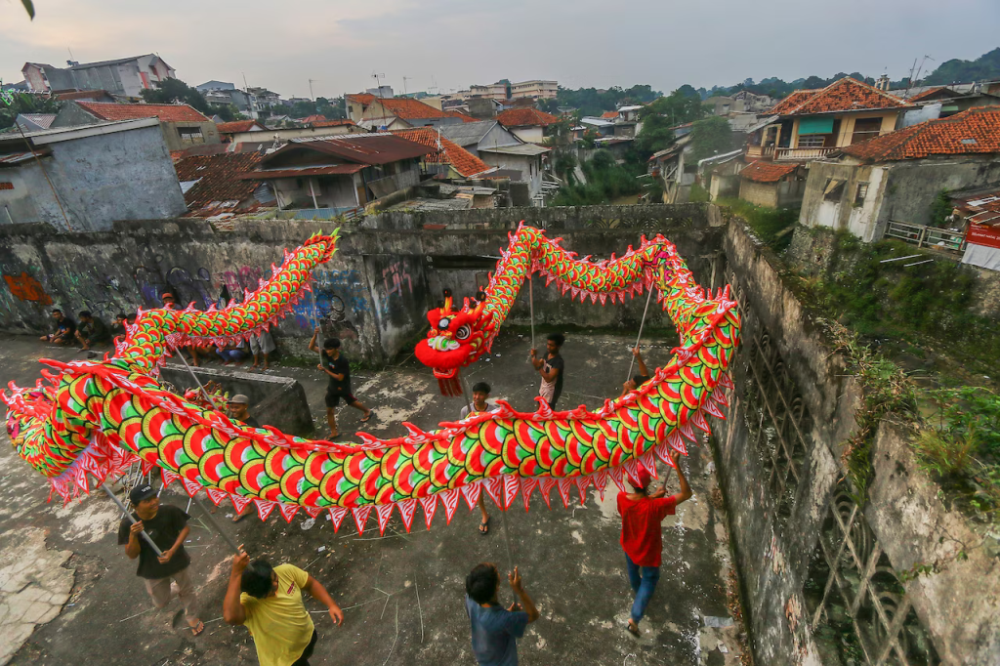
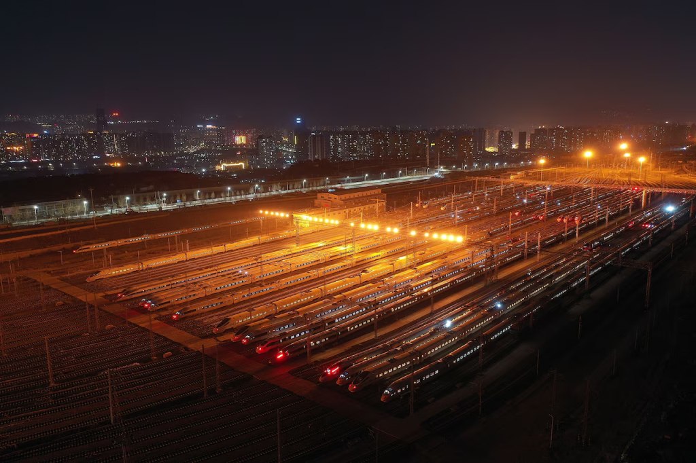

By Erin Blakemore - National Geographic

Celebrated around the world, Lunar New Year usually **_prompts_**[1](#ba69c468-7548-48ea-a6b1-d41656c253cb) the planet’s largest annual migration of people. And though it is known to some in the West as Chinese New Year, it isn’t just celebrated in China. Lunar New Year falls this year on January 29, 2025, **_kicking off_**[2](#d13db9ec-53fe-48fe-9e33-9393c8c75d9e) the Year of the Snake. It is traditionally a time for family reunions, plenty of food, and some very loud celebrations.

## **What is Lunar New Year?**

Modern China actually uses a **_[Gregorian calendar](https://www.nationalgeographic.com/travel/article/calendar-new-year-celebrations-around-world)_**[3](#0f1a6269-915d-4872-abbc-5a24d814d9ca) like most of the rest of the world. Its holidays, however, are governed by its traditional [lunisolar calendar](https://www.timeanddate.com/calendar/about-chinese.html), which may have been in use from as early as the 21st century B.C. When the newly founded Republic of China officially adopted the Gregorian calendar in 1912, its leaders [**_rebranded_**](https://www.thatsmags.com/china/post/8389/explainer-why-is-chinese-new-year-called-spring-festival)[4](#55f32760-ed7d-4bc8-ae06-c401a85f99c3) the observation of the Lunar New Year as Spring Festival, as it is known in China today.

As its name suggests, the date of the lunar new year depends on the phase of the moon and varies from year to year. Each year in the lunar calendar is named [one of the 12 animals in the Chinese zodiac](https://www.vam.ac.uk/articles/the-lunar-zodiac#slideshow=8683334511&slide=0), which are **_derived_**[5](#a3819b91-1dd1-47ed-ad0a-0959d27b060e) from ancient Chinese **_folklore_**[6](#8c2e0c6b-e956-4f40-adea-0246f2ed1327). Repeating in a **_rotating basis_**[7](#5937f884-a139-4150-9884-1abd554bd9c4), these animals are the rat, ox, tiger, rabbit, dragon, snake, horse, goat, monkey, rooster, dog, and pig.

Today, Spring Festival is celebrated in China and Hong Kong; Lunar New Year is also celebrated in South Korea, Tibet, Vietnam, Singapore, Indonesia, Malaysia, and places with large Chinese populations. Though the festival varies by country, it is **_dominated_**[8](#23944e14-8bed-4864-97cc-08872de17e81) by themes of reunion and hope.

## **How Lunar New Year is celebrated**

For Chinese people, Spring Festival lasts for 40 days and has multiple sub-festivals and rituals. The New Year itself is a seven-day-long state holiday, and on the eve of the new year, Chinese families traditionally celebrate with a **_massive_**[9](#4c4629f9-8ffa-44e0-8220-ec1e14467cc0) reunion dinner. Considered the year’s most important meal, it is traditionally held in the house of the most **_senior_**[10](#e2c001c6-7131-4b55-b83c-d326dfc8cb40) family member.

The holiday may be getting more modern, but **_millennia_**[11](#477ee5cc-1581-49ed-bc2f-fe0486402644)\-old traditions are still **_held dear_**[12](#739fe563-d244-406f-94a2-223617a39363) in China and other countries. In China, people customarily light firecrackers, which are thought to chase away the fearful monster Nian. (However, the tradition has been on the decline in recent years due to [air pollution restrictions](https://doi.org/10.3390/atmos13091388) that have hit the fireworks industry hard.) The color red is used in clothing and decorations to ensure prosperity, and people exchange _hongbao_, red envelopes filled with lucky cash. 

Meanwhile in Korea, people make rice cake soup and honor their ancestors during [Seollal](https://asiasociety.org/korea/seollal-korean-lunar-new-year). And during Tet, the Vietnamese Lunar New Year, flowers play an important role in the celebrations.

Lunar New Year has even **_spawned_** [13](#398dabb1-0b95-481c-a67d-21b1a5dd2caf)its own form of travel: During _chunyun_, or spring migration, hundreds of million people travel to their hometowns in China for family reunions and New Year’s celebrations. In past years, [billions of travelers](https://www.chinadaily.com.cn/a/201912/19/WS5dfaee4aa310cf3e3557f3f6.html) have taken to the road during the 40-day period. Known as the world’s largest human migration, chunyun regularly [**_clogs_**](https://www.smithsonianmag.com/smart-news/100000-travelers-were-stranded-chinese-train-station-180958016)[14](#7f6a2d96-83fc-43a6-9e9b-773d53d7c304) already busy roads, trains and airports—proof of the holiday’s enduring significance for those who **_associate_** [15](#b581350f-c687-4550-8a13-b64252c71802)it with luck and love.
