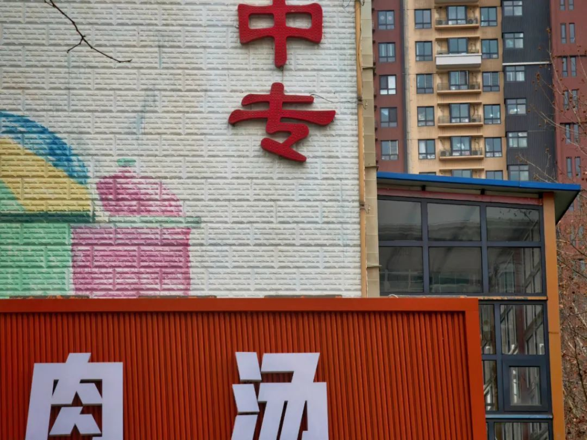
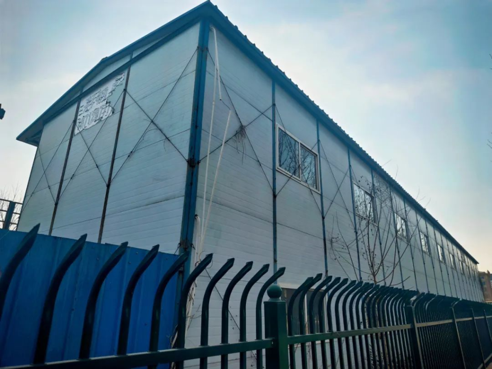
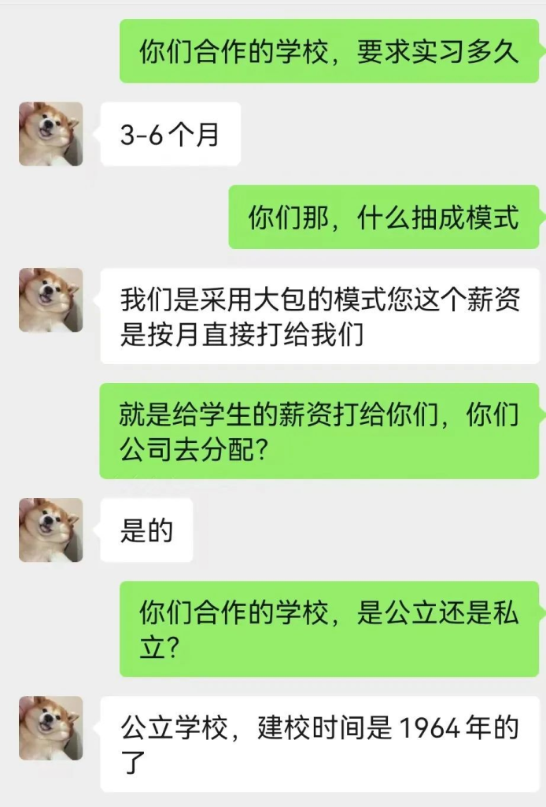
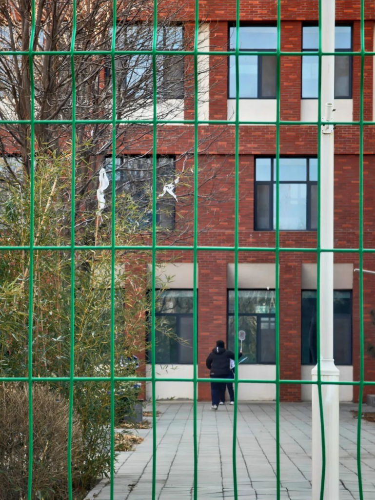
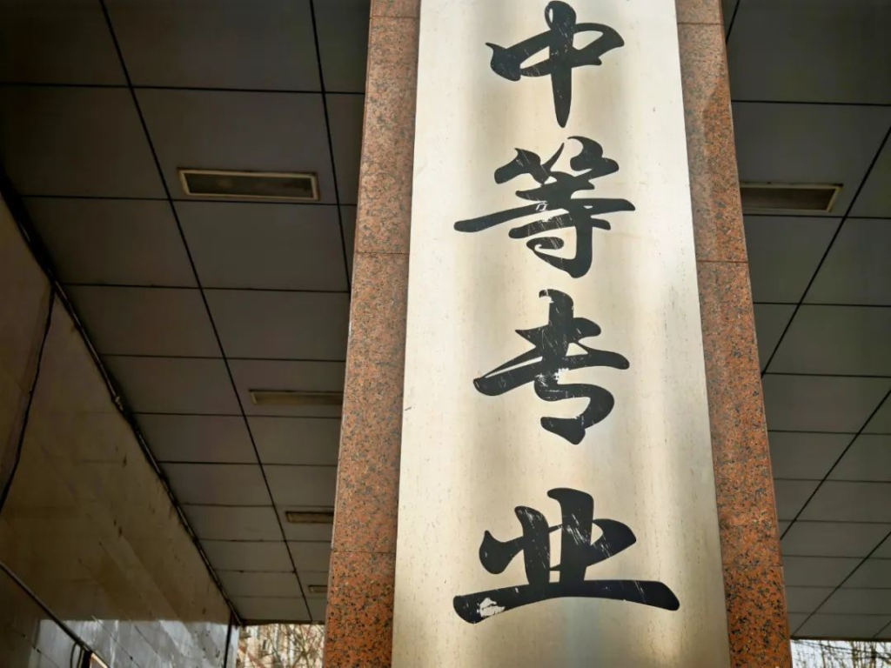

**文丨東昇**

**编辑丨雪梨王**

这是一场有关职校实习生“买卖”的饭局。

做东的是吴玉良，北方某市人力资源公司老板。公司里唯一的业务，就是有关职校实习生。在这行，吴玉良做了快六年。酒席上受邀的五个人，是圈子里颇有名望的中介。他五十来岁，腹部隆起，零星的几缕发丝倔强地坚守着最后的阵地。

“干我们这行，就是买卖人头。”吴玉良侧过头对我说——他知道我的记者身份，但似乎并不忌讳。吴玉良组局，是想找大家帮忙出出主意，成立一所民办中职院校。“教学只是一方面，主要是往厂里输送实习生。这行业那点儿秘密，都是公开的。”

所谓“秘密”，的确算不上秘密。它只是围绕职校实习生的一笔交易。

按照教育部等8部门2022年印发的《职业学校学生实习管理规定》（以下简称“职校生管理规定”），“学生在实习单位的岗位实习时间一般为6个月”、“学生实习考核要纳入学业评价，考核成绩作为毕业的重要依据”。规定中的职校生“是指实施全日制学历教育的中职学校、高职专科学校、高职本科学校学生”。

也就是说，职校生要想顺利毕业，必须经过实习。依据规定，实习“对于建在校内或园区的生产性实训基地、厂中校、校中厂、虚拟仿真实训基地等”都是可以的。由于类似基地成本很高，部分学校无法将其建在校园内，因此只能选择将学生输送到工厂。

吴玉良解释，这样一来，学校可以挣人头费。而为了省事且不惹麻烦，一些学校会把向厂里输送学生的活儿，交给相熟的中介去办。双方对外的名头是“合作”——厂里支付足额薪水，但这些钱往往打给中介，由后者分为三份，学生、学校、中介各一份。被克扣的薪水，一般被称为“管理费”。

2024年世界职业技术教育发展大会上发布的数据显示，我国职业学校每年培养毕业生超过1000万名。这让吴玉良等中介看到了巨大的商机。于是他不满足于只做中介，而试图直接成立学校，“做甲方，或者甲方乙方都做。”

利益线条上的另一端，则是一些职校生无法逃脱的命运。

**“欢迎xxx学子”**

如果把学生看作商品，吴玉良最不担心的就是货源，“这行最绝妙之处在于，职校生必须实习才能毕业，不想干也得干”。因此他从不担心找不到用人单位，只要手里有人，总有企业主动找他。看到我有些怀疑，他当即让助理在社交平台发了条虚假信息：“中职院校，实习学生300人左右。”

一小时后，收到40多条来自不同IP的评论，“急需，请看私信。”

李翔是吴玉良的“商品”之一。2025年春节前，他结束了南方工厂的实习，回到老家。

老家在河北省一个还算富裕的村子。和大多数农村孩子一样，李翔按部就班在村里上完小学，镇上读完初中。2022年中考过后，他进了一所民办中专，学的是计算机网络技术专业——在此之前，他和计算机唯一打交道的方式是打游戏。

整个教育体系中，职校生一度成为沉默且时常被忽视的群体。尽管2022年5月新《职业教育法》实施，首次以法律形式确定了“职业教育与普通教育地位同等重要”，但这似乎未能从根本上打破人们对职校生的刻板印象。社会给他们贴上“学习不好”“打架混日子”的标签。HOPE学堂的发起人梁自存此前接受采访时说，自己在职校调研时，常听学生讲的口头禅是，“我就是个垃圾”。

“你还指望这帮孩子干吗？咱把自己当成幼儿园，给家长看好孩子别出事就可以。”在北方某市私立中专做行政的冯妍不止一次听校长这么说。潜意识里，她也觉得这帮学生就是学渣，“上课睡觉、说话、顶撞老师；下课打架、玩游戏、谈恋爱，没一个让老师省心的。”

李翔很早就接受了自己是“学渣”的现实。他发现，初中同学很快分成了两个阵营——高中生和中职生。上高中的同学看不起中职生。同学群里，高中生们正聊得起劲，只要有中职的同学一加入，高中生们就自觉闭麦。父母的朋友来家里做客，问起李翔在哪儿上学，父母只说“在市里”，绝口不提学校的名字。

“我上的中专，还是民办的。”李翔觉得，中职生和它附加的标签早已锁定了自己的人设。但他很快又释然了，“我们本身就在最底层了，再低还能低到哪儿？”

职校里教的网页制作和JAVA编程基础，他根本听不进去，“就是换个地方睡觉”。刚入学时，老师就告诉他们，“职三（三年级）上学期，都要进厂实习，否则不发毕业证，这是上面的规定。”

李翔期待实习，那意味着可以尽早毕业挣钱。

他因此羡慕那些学长——他们如同候鸟迁徙一般，每年6月，被一辆辆大巴拉走实习，6个月后，再被大巴送回。他向一位学长问起过实习的经历，后者脸上透着疲惫，“累，和牛马差不多。那些岗位不用上学，直接去干就可以。”

“那能不实习吗？”李翔问。学长说，不可以，“除非你不想要中专毕业证了。”

中专证对李翔来说，并没有多大吸引力。一次放假回家，他对父母说，不想读书了。父亲马上反对，“不上学，就得跟着村里的人去建筑工地；上个学，好歹能进厂，以后相亲，工人（的身份）也不丢人。”

终于熬到了实习期。2023年5月，二年级快结束的一个上午，班主任说，大家准备一下，去南方实习六个月。有人问老师，可以自己安排实习吗？老师明确表示，不可以。末了，她劝大家，进厂实习好，既能挣钱，还能早点儿适应社会。

李翔们有些兴奋。即将到来的体力劳动带有一种处于学校范畴外的、只属于真实成人世界的光环，这至少意味着他们不用再守着书本上晦涩的文字和符号昏昏欲睡。

出发前，学生们签署了一份《职业学校学生岗位实习三方协议》，协议内容的三方，包括学校、实习单位和学生本人。李翔这份协议中的实习项目是在南方某印刷厂，实习岗位为“智能操控”，报酬每小时23元，工作时间每天8小时。

李翔点开手机上的计算器App，每月能挣5500多元。实习半年，就是3万多元——这是他从未见过的金额。合同上更多内容，他没细看，只记得其中提到，实习单位免费提供食宿、工装，学校和企业给学生投了责任保险之类的。

带着城里孩子“去春游”般的憧憬，李翔上了那辆白色大巴车。

他们这届学生分为4个班，共200人。除李翔所在的班是“计算机网络技术”专业，其他三个班分别为金融服务、酒店管理、汽车营销与服务专业。30多个女生，全部集中在酒店管理专业。发车前，校长拿着话筒，说学校会派两名驻厂老师共同前往，全程陪同实习，学生有任何事情，都要通过驻厂老师解决。

1800公里的路，车子足足开了33个小时。李翔发现，大巴车上除驻厂老师外，还有一张陌生的中年面孔——事后他才知道，那是吴玉良公司里的一个中介。

厂里举办了简单的欢迎仪式——有人专门等待他们；大门口挂着条幅“欢迎XXXX职业学校学子前来我厂实习”。

“学子”二字让李翔意外，“社会上都叫我们中专生或者技校生，突然被叫学子，挺不习惯。”他偷偷拍了张条幅照片发到家庭群。亲戚们纷纷跟发点赞、鲜花，一个表弟发了个坏笑表情，附文说，“祝我哥实习快乐，早挣大钱，早日光宗耀祖。”

**成人的世界**

李翔所在那辆大巴车上的同学，全被分到了印刷厂。

工作是打包和搬运图书，即在成品书出来后，用白色塑料捆绑绳将书捆成一摞，每摞20本，提到指定地方，再由搬运工推着手动叉车运输到仓储车间。用主管的话说，印刷厂里的绝大部分工作，需要一定的技术含量。打包和搬运，则基本靠体力。

这时李翔才反应过来，合同里写的“智能操作”只是个幌子，完全就是人工操作。

“真实成人世界”的光环消退，生活无比枯燥——早上七点多起床，换上蓝色工作服；八点开工，将一本本装订好的书摞起、打包、搬走，像是无情的机器。这个工种，除职校实习生外，还有些附近村里的中老年人，他们每天骑电动车上下班。

车间里布满摄像头，偷懒或说话，会被批评并扣薪水。

按照主管的要求，工人们从早上8点干到12点，午饭过后，再从1点工作到5点。算下来是8个小时，但实际上，所有人都得至少加班两小时。加班每小时多付7块钱。

这样的日子李翔不到半个月就受不了了。住在白色双层集装箱搭建的移动房里，他总会做梦，第二天醒来恍惚中以为自己回到了学校。他给家人打电话，说不想干了，父亲骂他不能吃苦；他给驻厂老师发微信吐槽，老师让他坚持下，不要影响毕业。

如果说体力上的疲惫尚能坚持，脑力上的劳动则更成了他的负担——每天加班两小时后，职校实习生们会被要求手写一篇不低于300字的实习日志，驻厂老师每周来收一次。

老师叮嘱他们，不能写当包装工、搬运工，要上价值，写模糊的工作心得。

于是每天加完班，李翔都会老老实实地坐在马扎上写日志。他只想写“累”，但这过不了关。他开始编造那些假大空的话，偶尔还会从网上抄些自以为的金句，“我在实习岗位很开心……实习能让我把理论知识转化为实践”“今天工作最大的感悟，就是细节很重要，细节是成功的基石”“我发现，工作要用大局观”。这些万能句子，放在什么地方都不违和。

状态好的时候，他一天可以写完7天的日志，“扎扎实实走形式，能毕业就可以。”

“走形式”是李翔在成人世界学到的重要一课。他因此觉得自己该把这个形式完成得漂亮点儿，“老师满意，学校满意，工厂满意，这才是最好的结局。”

**被克扣薪水**

幻灭出现在拿到工资的那一刻。李翔算了下工作时长，判断自己可以拿到5000多元工资，可最终到手的只有3000多元，同工种的老员工，则拿到了六七千元月薪。

按照“职校生管理规定”，实习单位发放的薪水“原则上应不低于本单位相同岗位工资标准的80%或最低档工资标准”。李翔一打听，发现所有同学的工资都被扣掉了一两千元。

驻厂老师先是语焉不详，被问烦了，才说是“学校扣的管理费”。

至于“管理费”去向，老师解释说，一部分给学校，一部分给人力资源公司，即中介。直到这时，职校实习生们才知道中介这个角色的存在。至于扣钱的理由，除了管理费，还有违纪。比如上班偷懒、去厕所时间过长、未经允许打电话等。而厂里那些经常聚在一起偷懒、抽烟、打牌的老员工们，倒是没被扣钱。

“当时很不理解，活儿都是我们干的，钱却被分走了。”职校生们为此去找厂里主管。主管说，他不和学生直接对话，有事找驻厂老师。

直到有人打了当地市长热线，厂里终于出面解释，说是“已经把足额的钱打到了人力公司，那些违纪罚款也和厂里无关，建议还是找学校协商。”也就是说，职校实习生们每月拿到的薪水，其实是通过中介打过来的。

依据“职校生管理规定”，实习生的薪水要“足额、直接支付给学生”“不得经过第三方转发”。于是有人提出报警，但又担心影响毕业，最终忍了下来。

“一个学生就算每月扣1000元，300个学生每月是30万，半年总共180万。”李翔算了笔账，“这笔钱如果学校和中介平分，意味着他们啥也不干，半年就能挣90万。”

和老员工们慢慢熟悉起来后，有人私下向学生们透露，像他们这些职校实习生，送走一批，再来一批，都是被克扣过来的，“克扣薪水的事，厂里都知道。只是他们不想得罪中介和学校，怕招不到相对便宜的学生工，因此都装不知道。”

上网检索后，李翔发现，在利益链条裹挟下，职校实习生早已成了中介和学校的摇钱树。

此前有职业打假人在网络发帖说，“江西新能源科技职业学院的张老师和前妻颜某某都是学校职工，两人离婚后，张老师于2023年2月无意间发现颜某某有600万元的巨额存款。张老师同时还发现了一个涉及金额数千万元的账本，账本中记录了人力资源机构转账给学校多名领导的明细和分配比例，其中打到颜某某名下的金额就有600万元。”

这些钱，就是职校实习生们被克扣的报酬。一个账本上写着，总结19.5元（时薪），学生15元/小时，学校4元/小时，本人0.5元/小时——实习薪水按照这个比例被分成了三份。此事最终经由官方处理，相关人员被惩处。

而更多控诉的声音隐匿在社交平台上那些难以被发现的角落。有学生发帖说，“（企业）一小时的工价是22，我们学校呢，给到学生的是8元一小时……而你作为学生，你的身份证在人家手里，你是没有任何话语权的，你唯一有话语权的时候就是进厂那一刻之前在大巴车上的时间”“我弟弟现在去实习了，一小时8块钱，能跑吗，说是跑了不发毕业证”。

不敢反抗，又无处可逃，成了李翔们的共同处境。

“累，无聊。”半年后，回到学校，面对学弟有关实习的问题，李翔给了个最简短的答案——真实的成人世界并不好玩，他需要重新思考人生。

**“你是我见过最垃圾的老师”**

克扣薪水的事，总会被反馈到冯妍这里。她是北方某市一私立中专的驻厂老师。

“我们听说，学校克扣我们的实习费，驻厂老师也参与了，你们给出解释，否则，曝光你们。”六个月的驻厂实习结束后，一个学生在微信群里公开说。

冯妍回复了三个微笑表情，将群设置成免打扰模式。

“动不动说要自杀，要跳楼，不想活了。”当了半年驻厂老师，这些威胁对冯妍来说司空见惯。学生们矿工、迟到、晚上跳墙出去玩都是小事，一个学生因为不想实习，在男厕所里写大字，说“老板是黑心资本家，和厂里XX有一腿”。

按照校长当时的说法，驻厂工作很简单，三个老师，每人负责100人的管理，平时就是去厂里看看，查查寝室，以及解决学生的各种问题。驻厂的半年，月薪比平时多2000元。

冯妍脑子一热，报了名。一个曾经当过驻厂老师的“前辈”告诉她，学生们“肯定不好管，放平心态，别出人身安全事故就可以。其他的事，尽力就好。”

不同于李翔们住的活动板房，冯妍带的学生全部入住了企业自建的宿舍楼——她负责的100个学生，机械专业的去了电子厂，商务英语专业的去了一家银行的外包客服中心。

南方气候湿热，几个宿舍有些霉味。于是分宿舍当晚，冯妍接到了学生家长的电话，上来就是一顿炮轰，“你们学校咋这么没良心，拉着我家孩子去打工，还让我孩子住狗窝，良心被狗吃了吗？”冯妍想解释，家长听不进去，丢下一句“要投诉你们”，挂了电话。

接下来的半年，不管深夜还是凌晨，不断有学生找她吐槽，“不习惯厂里环境”“不喜欢这里的食物”“不喜欢这份工作”“不喜欢主管”“不喜欢上班”“女朋友不喜欢我”……在所有“不喜欢”后面，学生们都会加一句“老师，怎么办？”——他们急切地想要从一个真正的成年人这里得到答案。

但冯妍通常找不到答案。她只能反复劝他们，不要想太多。做驻厂老师后，她的微信总会出现500条未读信息。有些信息5分钟内没来得及回复，学生就开始闹脾气，“老师都什么素质”“一切都是你的错”“你是我见过最垃圾的老师”。

驻厂老师最怕的就是自己负责的学生出事。之前的驻厂老师告诉冯妍，他们有一届学生进厂实习时，在网络上认识了些朋友，被骗到国外搞电信诈骗去了。

也是当驻厂老师后，冯妍才学着在中国裁判文书网搜索相关案例。她的目的很简单——从案情中接受教训，自己尽量避免。她对两个案子印象深刻。

其中一个是，重庆一所中职学校旅游专业的学生，被安排到重庆渝北区某产业园实习一年，就在马上要结束实习的2024年2月10日凌晨，这名学生在宿舍内休息时死亡。公安机关认定其死亡原因为∶缢死。

还有个案例是，2021年12月24日，河北邯郸一所职业学校的学生通过中介，被安排到上海工厂做包装工后，一名姓郗的学生于2022年1月5日下午从实习单位宿舍离开，却在2022年1月16日在厂外被发现溺死。

冯妍因此对学生的安全问题格外敏感。一次，厂里主管打来电话，说有3个男同学早上没上班。冯妍立刻拨通了他们的电话，却无人接听。她骑着共享单车在工厂周边找了大半天，依然不见踪影。冯妍报了警，同时通知了校方和家长。

找了一整天后，到了晚上，那几个学生开开心心回了厂，说是上班太累，出去玩了。

“都说不实习或实习不合格会影响毕业，可人家不在乎啊。”实在气急了，冯妍会拿“不发毕业证”吓唬学生。“谁会在乎那个中专证呢”——她总会得到这样的回复。

驻厂结束后不久，冯妍辞职了。她觉得在职校没前途，打算继续考公或考个教师编。两者相比，她更倾向后者，“我不想以后教出来的学生，都在工厂打工。”

**隐秘的交易**

“只要实习仍是毕业的必要条件，这行就是朝阳行业。”把职校当成生意的吴玉良确信自己选对了赛道。在这场隐秘的交易中，他似乎不担心招不到学生，“中职不行，还有高职呢，怕什么？”

2025年春节前，吴玉良一直忙着到处送礼，礼物是标准套装——两盒茶叶、四条中华烟、一箱高档白酒，以及一盒高档护肤品。送礼的对象几乎都是职校校长。

做职校实习生生意前，吴玉良做的是向工地输送农民工。他的原始积累也来源于此。渐渐的，建筑行业的钱不好赚了，有人建议他拿职校实习生当货源。“现在很多大型工厂最缺的就是人力。用学生工的话，企业负担的工资成本比正式职工至少低20%，还不用承担五险一金。”吴玉良告诉我，这行门槛不高，最关键的环节无非是打通职业院校的关系，“也不用多，校长和就业办主任就可以。”

市面上专门做职校实习生的中介很多，学校和学生资源相对固定。校方和谁合作，取决于谁的公关手段更高。

初入这行时，吴玉良看中了一个老牌职教中心。他通过一些社会关系找到校长，后者一直拒绝见面。之后在中间人的介绍下，他终于得以和校长坐到饭桌上。吴玉良记得，那次饭局，自己喝了两瓶茅台。那之后的半年，他像保姆一样服务校长，大到外出开会，小到陪校长的老婆买菜。最终，校长答应给吴玉良200人的资源，让他试一下——学校彼时另有600多名实习生。这些实习生，被校长分给了不同中介。

有了生源，吴玉良很快联系到南方一家电子厂，将这些实习生全部送了进去。厂里给每个学生的时薪是24元，吴玉良从中扣掉了每人每小时10元管理费。以此计算，他每天克扣一个学生80元，一个月下来是2400元，200个学生就是48万元，半年下来，就是288万元。去除一些成本，这单生意，他和校方各赚了100多万。

从学校层面说，这100多万仅仅是这200个学生带来的，剩下600多人的回扣还没算进去。

这笔生意让吴玉良看到了商机。他愈发觉得，只要有生源，就会挣钱。他也认识了更多校长，结识了不少招生办主任，慢慢摸清了门道。

吴玉良透露，业内利润模式有两种，一种是克扣学生时薪，另一种是“打包人头费”。所谓“打包人头费”，就是让企业以每个学生300元-500元提成，一次性给中介，中介再去和校长分配。由于企业先付了这笔人头费，后期给到学生的时薪自然会降低。至于中介给学校的分成，有的校长不敢私自使用，便把钱存到学校的“小金库”，用于日常一些不便进账的花销。招生办主任则一般不参与分成，“每次确定要往厂里送学生时，单独给招生办主任送钱。人数不同，送的也不同，几万到十几万不等。”

一些职业院校因此愿意找中介合作，“有我们在中间，学校就可以放心挣钱呀。”吴玉良说，其实学校不通过中介也可以，但这样一来，克扣学生实习费就比较难办，有中介这关，大家都相对安全。而中介与学校一般会打着“合作”的名义——中介给学校交几十万元保证金，由学校与其签订联合办学协议。其中，校方负责组织生源，将符合实习条件的学生输送给中介，中介去寻求企业安排学生实习。甚至一些驻厂老师，也是由中介公司招募的人，或者中介承担驻厂老师的额外补助。

实际上，“职校生管理规定”早有明确，不得“通过中介机构或有偿代理组织、安排和管理学生实习工作”，但在利益链条的裹挟下，违规行为层出不穷。

吴玉良也担心出事，尤其担心校长出事，“他一出事，把我们一招，指定都得进去。”在中国裁判文书网搜索关键词，能搜到多个此类案件，学校相关人员涉及的罪名，多是受贿。

比如四川省宜宾市南亚电子职业学校原校长、法定代表人刘某，自2016年以来，与东莞一家人力中介合作，由中介操作，派遣该校学生到东莞两家工厂实习，刘某则从中介那里收了90.4万元“管理费”，用于自己购房、个人消费等支出。河南周口某女子职专原法定代表人杨某灵，2014年至2020年，安排学校一个副主任与中介，和东莞一家电子厂签订学生实习合作协议，企业总共付了2131万元实习薪资等，但学校只支付给学生1383.3万元，剩余700多万被侵吞了。

学生的安全问题也是潜在隐患。由于实习生进厂无法签订正式劳动合同，也无法购买各种社保，一旦发生伤亡事故，就很棘手。“比如去上班的路上发生交通事故，在厂里受伤了，压力太大自杀了。”吴玉良认识不少同行，每年都因此被起诉。每到这时，学校就把压力给到中介，让他们无论花多大代价，都得把事情摆平。

“你摆平过这类事情吗？”

“有，但不能说。”吴玉良顿了顿，“没有涉及人命的，但受伤的处理了好几次。”

虽说不担心“货源”，但吴玉良也承认，能够“进行买卖”的职校生只是一小部分，且主要集中在民办职校，“公立学校还是好很多。”

所以，眼下他正忙着筹办一所民办职校——他知道公立学校不可能参与——要想把生源牢牢攥在手里，就得成立学校。“到时候，不管是中介还是工厂，都得听我的。”他端起100毫升的白酒分酒器，语气里带着几分志在必得，“办学校是件好事，总得给那些成绩不好的孩子一条出路。”酒桌上的人点头附和：“对对对，咱们当校长、做校董，不当老板了。”一侧的餐边柜上，一箱53度的飞天茅台和4条硬盒中华烟见证着这场生意的谋划和布局。

即将完成这次采访时，李翔告诉我，他原本想报对口高考（专门针对中等职业学校毕业生进行对口升学的一种考试形式，以“专业技能+文化考试”成绩为录取依据，和普通高考一样，须参加高考报名），但错过了报名时间。于是他放弃了这个选项，“就算考过了，大概还是上个高职，最后还得进厂实习。但凡上的学和‘职业’俩字沾边，基本逃不过进厂的命运。”

今年6月毕业后，他大概率还是会去找个南方的工厂打工。毕竟在温暖潮湿的南方，他第一次被称作“学子”。

（应受访者要求，文中所涉采访对象姓名均为化名）
