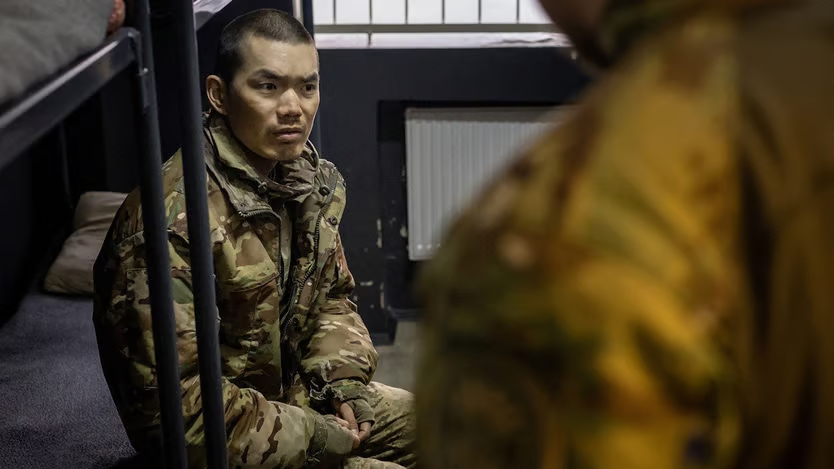
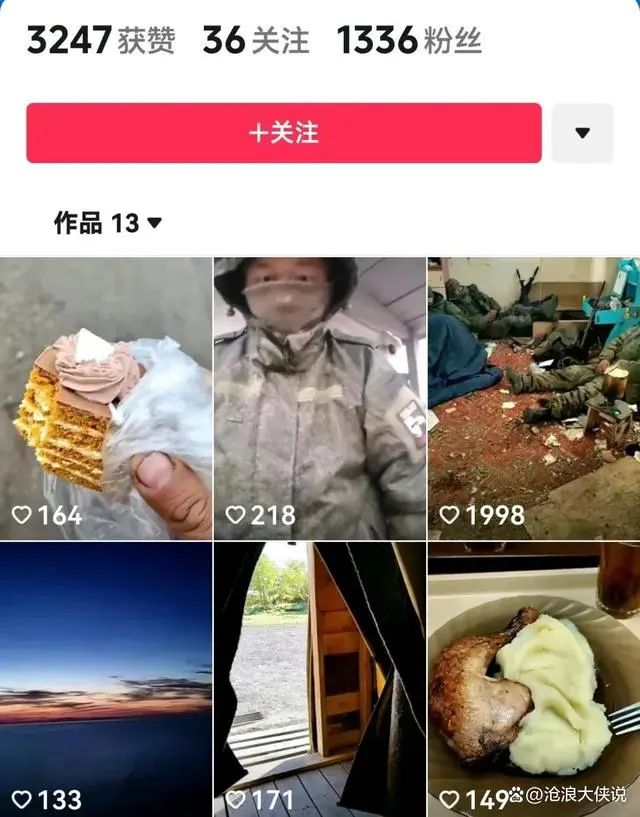

The Economist

On april 8th Ukraine’s president, Volodymyr Zelensky, posted a video on X that he said showed one of two Chinese citizens captured by Ukrainian forces while fighting for Russia. China was now militarily supporting Russia, he added in a **_press briefing_**[1](#36e65a59-5c91-473f-bc37-de8b215f358b), and “the United States of America should pay attention”. The next day he posted a second video of both men, who gave their names as Zhang Renbo and Wang Guangjun, and shots of their Chinese passports. Mr Zelensky claimed Ukraine knows of more than 150 Chinese nationals fighting on Russia’s side.

China’s foreign **_ministry_** [2](#5fc5f3e0-9812-4be1-bbe5-ae5af94bb9ea)responded that it is verifying the Ukrainians’ claims and that it does not support its nationals’ participation “in any party’s military operations”. Though China has supplied **_dual-use_**[3](#8b8a477e-71d9-4d4c-b64d-a55c8a29dedc) **_components_** [4](#6c853fe7-dfa4-461a-930e-20dabd61b163)for Russia’s defence industry, kept Russia’s economy **_afloat_** [5](#37ee28d7-d602-4e5b-8ba1-fcbebd3982be)with energy purchases, and promoted **_propaganda_** [6](#ccded093-0877-4eca-9cb8-78e17d5f9087)blaming Ukraine and NATO for the war, its leaders have consistently claimed **_neutrality_** [7](#a89c021d-21a3-4443-a76b-7cefca125a01)and been careful to avoid direct military involvement. There is no proof that the Chinese nationals fighting for Russia in Ukraine are state-supported. It is no surprise, however, that they are there. Chinese fighters on both sides in Ukraine have been posting videos of their exploits on social media throughout the war.

Those who fight for Russia have said they go seeking **_thrills_** [8](#05cc3758-1823-4924-adad-cc23fa983d62)and cash. Some are also driven by nationalism. A 23-year-old from Gansu province told Initium, an independent **_outlet_** [9](#7fbb4e30-6cd1-4fe1-8df7-1035123b1ab5)based outside China, that he flew to Moscow in 2023 after seeing a social-media video promising high wages. He had been a firefighter making 3,000 yuan ($400) a month. As a **_mercenary_** [10](#96eb860b-2208-4450-a3de-9420a25a3c00)he could make five times more. Another fighter calling himself “Red Macaron” on Douyin, China’s TikTok, said he wanted to experience war, inspired by jingoistic Chinese films. He joined the Russian side because it was easier to get a visa, he told Chinese media. Zhao Rui, a 38-year-old from Chongqing, reportedly joined the war because he wanted to fight any Japanese who were helping Ukraine. He was killed in 2023 by a Ukrainian **_drone_**[11](#173df500-ee7a-4f15-8fbe-01e829e26eed).

What unites most Chinese soldiers is regret. Before his death, Mr Zhao had posted videos on Douyin telling fellow Chinese not to come. “Find a job in China, you can make the same amount,” he said. Zhou Zhiqiang, another mercenary, said on Douyin that the Russians “don’t treat us like humans”. In a recent interview with Chai Jing, an **_exiled_** [12](#1759375d-4b57-44a0-b943-233f1b6b868e)Chinese journalist, “Red Macaron” said the Russians were using them for “**_cannon fodder_**[13](#7e0ee5e7-ffcc-403d-b763-671bcce8f268)”. He had been locked in a **_pit_** [14](#51ae8449-15dc-4725-92d8-2bb5db920e61)alongside Russian **_deserters_** [15](#e2ca1717-f780-4796-ad52-ffeff7c263e0)after complaining about poor equipment. Now he had lost the will to fight but was not allowed to leave, and did not think the Chinese **_embassy_** [16](#f0ef6708-6512-4ac2-a8bb-a56533f1c63c)would help.

Some volunteers are also fighting on Ukraine’s side. Peng Chenliang from Yunnan province had been **_detained_** [17](#93d4b603-63a9-46c5-ab75-00dd9cc8f39c)in China for seven months after posting anti-Russia and pro-Ukraine messages on X in 2023. In 2024 he joined the Ukrainian army’s foreign **_legion_**[18](#78969056-10f0-4204-ba97-a2cef6b56682). He was killed later that year. Before his death Mr Peng made a video holding a Taiwan flag, saying he wanted to be remembered alongside Tseng Sheng-kuang, a Taiwanese volunteer who died fighting for Ukraine in 2022.

The deaths of Chinese fighters on both sides have sparked debate on the internet over whether they are brave heroes, dirty mercenaries or **_deluded_** [19](#c5cbac5e-9cf1-456b-ad05-e09d5f7d3398)nationalists. The Chinese government has not weighed in on that debate. Now it might have to.
