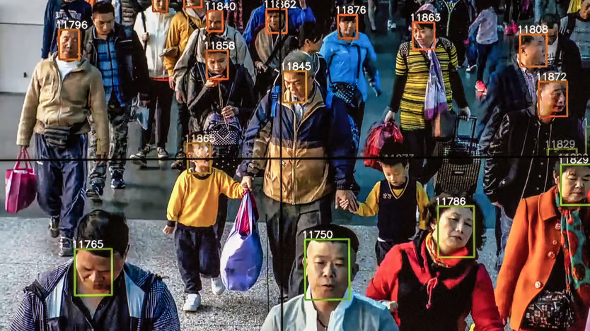
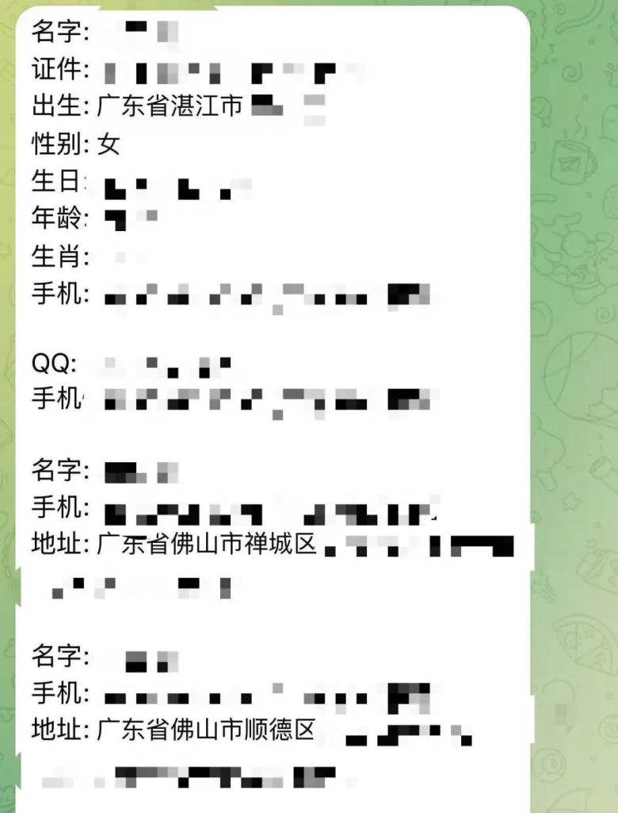

The Economist

Chinese **_netizens_**[1](#99308698-5ec3-4389-bd65-579d5f18cf09) joined people around the world in **_marvelling_** [2](#9834d333-9dd7-4a14-bb66-7db6d29759ea)that an American journalist could be accidentally invited into a private group chat with senior American national-security officials. But they have also been **_intrigued_** [3](#c8f89059-40c5-4bca-b0c2-3065742774ea)by another data leak closer to home. In March the teenage daughter of Xie Guangjun, an **_executive_** [4](#da56d07b-3fbf-4319-a933-b78adfdc6129)at Baidu, a tech giant, got into an apparently **_innocuous_** [5](#a02a5991-99aa-4cdf-8440-8ccf1d4cd36d)online argument over Korean pop music. After the exchanges **_escalated_**[6](#fb3fa483-6885-4236-8fd6-a6bcd78ae334), she posted some of the private information of her opponents online. Known in English as doxxing, in China it is called _kaihe_ (“opening the box”) or _renrou sousuo (_“human flesh search”).

The affair caused a **_stir_**[7](#9cfb267c-7ffa-4f84-bf73-9ab21e3b4d9b). Many **_suspected_** [8](#04544c7a-af33-47ab-ba28-c6711822b3fe)the girl had gained **_access_** [9](#79442d88-114f-4e4f-91cf-b537038d77ba)to the information through her father, since Baidu has data on hundreds of millions of Chinese people from its search engine and other apps. Mr Xie and Baidu have denied they were involved. But there is a simpler explanation. Any Chinese teenager can dox someone if they put their mind to it, because the country has a **_thriving_** [10](#32b4b331-8116-4f7b-b176-c3da6e2b5b0e)black market for personal data.

Trade in data takes place on messaging apps such as Telegram, which are technically banned in China but easily accessible to the **_tech-savvy_**[11](#5be56955-f58c-483b-a54f-1fda589a101f). Brokers offer everything from someone’s current mobile-phone location to their online shopping history. “Whether you’re a businessman…a potential father-in-law, or just in love, you can look into your partner, your son-in-law…or the people you’re lending money to,” promises one broker to their 20,000 Telegram subscribers. When contacted by _The Economist_, they said they could find details of someone’s _hukou_ (a **_household-registration document_**[12](#0bffb520-71ff-4478-b90f-cbb42232695c)), photo and identity-card number for just 600 yuan ($80).

In 2018 Robin Li, Baidu’s boss, claimed that Chinese people were “not that sensitive about privacy. If they are able to exchange privacy for safety, convenience or efficiency, in many cases they are willing.” That may have once been the case, but attitudes are shifting. A survey by Peking University published in 2020 found that Chinese respondents were more concerned about privacy than those in Germany, Japan, Saudi Arabia, Singapore or America.

They have good reasons to worry. Some who have had their data sold simply get **_hassled_** [13](#efac9a2a-68fd-466b-a6ba-68c02c6b1df5)by automated texts or phone calls. But others have been put at risk of blackmail or scams. **_Gangs_** [14](#1f728e86-35e2-40fb-96f1-af99daf42a04)of **_fraudsters_**[15](#be300700-e8e7-4f99-83fd-5387d451debc), often based in South-East Asia, generate much of the demand for Chinese personal data. From January to November last year China charged more than 67,000 people with online and phone fraud, a 60% increase on the previous year.

China’s government is wising up to the threat. In 2021 it passed a law which set strict requirements on companies to limit the collection and sale of personal data. Regulators have since **_slapped_** [16](#b60df687-9073-4fe4-9aa4-fbb182cf6dd1)huge fines on tech giants for **_slip-ups_**[17](#9c921f87-a2fa-4a18-b786-858fad280f33). Didi, a ride-hailing firm, was fined $1.2bn in 2022 for its **_lax_** [18](#bf581709-4d59-4c80-ac5c-e01fb65cc481)data management. Last year the police claimed to crack 7,000 cases related to the illegal data trade. In some cases employees at law firms, delivery companies and education consultancies had sold their clients’ data to criminal gangs. In others, hackers had **_extracted_** [19](#6f639a55-8caa-48d2-a51d-0eb062527078)the data from mobile apps.

China’s authorities are themselves a big part of the problem. The world’s biggest _**surveillance**_ [20](#3a733643-0395-44f3-8d9a-26924408e21d)state is very good at collecting data on its citizens but bad at keeping such data safe. Examples abound, and the Chinese media have sometimes been bold in covering the issue. In 2020 a public school in Sichuan province, in south-western China, was found to have uploaded photos of its students, along with their names, grades and identity-card numbers, on an unsecured online database in order to train a facial-recognition system. In 2022 a hacker calling themselves “ChinaDan” stole 1bn records of personal information and criminal cases from the Shanghai police. They appear to have lifted the records from another unsecured database.

**_Corruption_** [21](#15727dbd-f157-4e2d-b98c-6b7f2466f993)is as much an issue as **_incompetence_**[22](#ce0512f6-0656-4da6-83de-41dcb215fb26), notes Rogier Creemers of the University of Leiden in the Netherlands. **_Reams of_**[23](#26792e68-3ead-49e2-8b5d-7187b4e31efa) data pass through the hands of ill-paid officials, so it is no surprise that much ends up on the market.

In January the government announced an “action plan” that promised to **_crack down_**[24](#92ee5fe1-ecd0-4853-a03d-3a349ab7fae2) on “the black and grey industries that illegally obtain, sell or provide data”. For the moment Chinese citizens still tend to trust the government with their data (in part because bad news, such as the Shanghai police data leak, is often **_censored_**[25](#6459170d-71fc-4ec3-a96e-2ca8f115cc3e)). But if the problems continue, that could change. “At some point people are going to take you at your word,” says Mr Creemers. “If you are in charge of everything, why are you not solving this problem?”
