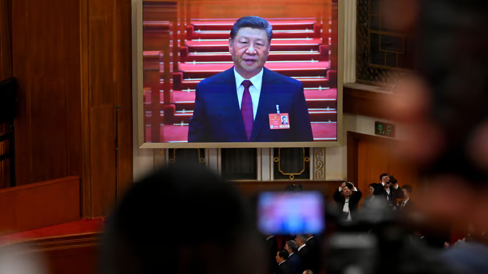

The Economics

The trade war is **_escalating_**[1](#d6bebf7e-d5b2-4207-b5d7-c6b89adb1635), and fast. On April 8th Chinese officials vowed to “fight to the end” in the face of new threats from Donald Trump, made just hours earlier, having already promised to match American **_tariffs_** [2](#3798a073-7728-45ea-ad7d-c07e144cdead)of 34%. With such an increase, China’s tariff rate on American imports will reach 70%. Later the same day, the White House confirmed that it would return fire, with tariffs of 104% applying to Chinese goods from April 9th.

There is little to prevent **_decoupling_** [3](#6942bb1f-a622-463d-b371-c2d26fab21da)between the world’s two largest economies. Although Mr Trump’s **_intentions_** [4](#7780fa19-ef7e-4795-9a33-745c1df260ee)in **_unleashing_** [5](#741a8e0d-de0a-4476-8dbd-204f071cbac3)the biggest [disruption to trade](https://archive.is/o/Me4aH/https://www.economist.com/finance-and-economics/2025/04/06/trumps-trade-war-threatens-a-global-recession) in modern history are not fully clear, he seems less interested in **_striking_** [6](#1bbd5dfa-7072-40de-8aba-8ae18cf9bf3d)a deal with China than ever before. All negotiations would be **_terminated_** [7](#f169b281-4f01-41b5-9da3-5a7f23f7edd9)if China **_imposes_** [8](#a2cca3c9-b17f-4b74-a7e6-a767554efb1a)its **_levy_** [9](#bffe3d11-315b-47d6-8698-a3af930f4719)of 34%, he said on his social-media site, when announcing the latest measures. Chinese officials call this a “mistake on top of a mistake”, and have not ruled out talks. Their tough response nevertheless probably **_forecloses_** [10](#cef7ba18-01a2-4327-b6a2-9917bf3510d6)that possibility.

Until the recent escalation, Mr Trump’s tariffs on China had been met with a swift but **_blunted_** [11](#d137c29a-12dd-48bb-8497-c0ff42bbb431)response. Chinese officials had been eager to show they would not be pushed around; at the same time, they were content to pick their punches, so as to limit self-harm and avoid further escalation. This, the thinking went, would allow for easier negotiations when the time came—a calculation that now appears to have been discarded.

One reason for the shift might be a sense among China’s leaders that they could win the trade war. Mr Trump wants a lot from his geopolitical **_rival_**[12](#f531ef0a-7fa7-42ce-8df1-2b3c6727a8f5), including **_stemming_** [13](#27f6e7e9-0ede-473c-ab52-966414454b3b)the flow of fentanyl precursors and help ending Russia’s war in Ukraine. America’s president has also **_revealed_** [14](#3f0c4edf-109d-4f98-8c0b-5c8728bb338b)that he does not want to be responsible for shutting down TikTok, a Chinese-owned short-video app popular among young Americans. Tesla, an electric-vehicle firm owned by [Elon Musk](https://archive.is/o/Me4aH/https://www.economist.com/business/2025/03/23/musk-inc-is-under-serious-threat), Mr Trump’s adviser, is **_vulnerable_** [15](#e3cf1d86-4963-404e-87e2-db78a9b769a3)to **_retaliation_**[16](#5d9509ef-2cec-4491-aed2-3285797c3b30), since it does about a fifth of its business in China. “This is huge **_leverage_** [17](#f37e717c-70b2-4d82-a89a-57a58be5c388)on the US government unless Elon is asked to go,” says Alicia Garcia Herrero of Natixis, a French bank.

Chinese officials may also believe that America will be unable to bear the **_inflation_** [18](#95a4e914-702a-45b1-a027-d136c9284200)and economic **_discontent_** [19](#256a7210-10f5-4caa-a485-40fbdfd8e9ff)caused by Mr Trump’s tariffs. Instead of “fighting to the end”, they may only need to fight until American consumer prices begin to rise or employment begins to fall. Senior advisers, government researchers and economists all point to this as the easiest way of bringing Mr Trump to the table. Some talk of finding ways to **_exacerbate_** [20](#d9a91598-e3b3-4fb1-9037-700a2c087955)the situation, perhaps by strengthening the yuan. This would be quite a gamble. By the time inflation had picked up in America, Chinese industry and supply chains would be suffering.

An escalating trade war means that Xi Jinping will need to do more to **_prop up_**[21](#e4316d8d-2ca7-4ae8-ba5f-caa4889ae14d) China’s economy. The potential shock is being compared to the global financial crisis of 2007-09, which **_elicited_** [22](#76c4e12f-38f5-42ae-aa49-c0869f8a2887)a **_stimulus_** [23](#95d8807a-af39-4e22-84d3-201bb6729aca)package of 4trn yuan ($590bn). Li Qiang, Mr Xi’s **_deputy_**[24](#cb5e9bd7-c2be-4545-ba29-e122f6f49040), said in March that the country was preparing for “bigger-than-expected external shocks” and that it was willing to enact policies to ensure economic stability. What this means in practice remains unclear. The _People’s Daily_, a state newspaper, said on April 6th that cuts to interest rates and banking-reserve ratios could come at any time. The paper has also said that local governments will help struggling exporters to find new sources of demand at home and in non-American markets. Soochow Securities, a Chinese broker, has suggested that China could lower tariffs on the rest of the world, while increasing export subsidies.

As markets around the world have **_reeled_**[25](#332690ea-b1f8-47cb-9a92-500363259996), China has been quick to step up support. On April 7th and 8th state firms entered China’s market to buy stocks. Owing to this assistance, the CSI 300 index of the Shanghai stockmarket rose by 1.7% on April 8th. Economists worry that stimulus for the real economy will arrive much more slowly, with any interventions **_piecemeal_** [26](#eaa28f76-2f9a-4a32-829d-6bb83d16ec8d)and reactive in nature, and **_materialising_** [27](#9d6f492e-8970-41de-8e44-2f6c33831c6d)only after a sharp slowdown. According to Larry Hu of Macquarie, a bank, things will get worse before they get better.

Mr Xi will also need to consider if he is willing to see China’s economy fully decouple from America’s. Although China has been **_pursuing_** [28](#09844b4f-7bff-4ace-b326-ad1beac003c6)technological self-reliance, it has largely rejected the notion of “decoupling”, seeing it as a way for the West to punish China. Now, however, there is growing support for it. A short list of planned responses, posted online by various well-connected commentators on April 8th, suggests that China is considering the suspension of all co-operation with America on fentanyl. Another idea is to ban imports of American poultry and other agricultural products, such as soyabeans and sorghum, which mainly come from Republican states.

China may impose restrictions on American services, too, where Uncle Sam still runs a trade **_surplus_**[29](#5756ea05-8ff3-4b76-b033-5f82cbea6f0d). This would include restrictions on American consultancies and law firms still operating in the country. It could also probe intellectual property held by American firms. These IP holdings may constitute **_monopolies_** [30](#d46a23a3-6fbe-44c6-b3f1-2011b12f6543)and earn excess profits, according to one influential blogger, who goes on to say that China’s success with an animated film, called “Ne Zha 2”, and the poor performance of “Snow White” in America, could help justify reducing imports of American films or banning them all together. If “fighting to the end” means matching any new American tariffs, Mr Xi will have to bite the apple of decoupling. ■
