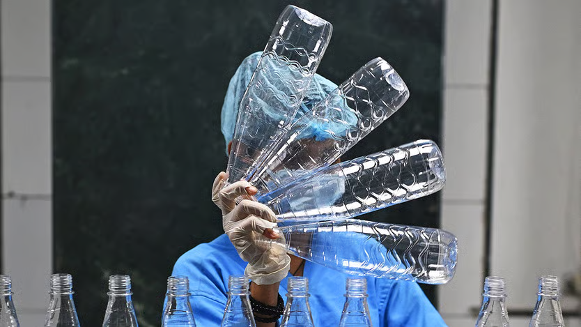
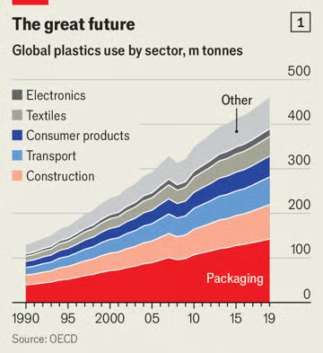
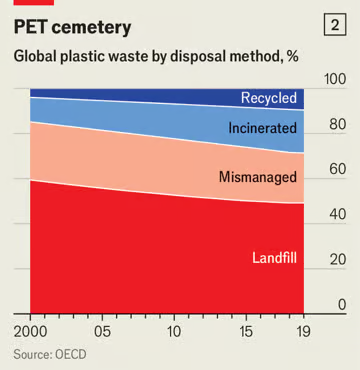

MICHAEL PHELAN, a famous **_billiards_**[1](#1469fe4c-3b14-4889-a06e-cd6df8e2ee9b) player and **_supplier_**[2](#073b420c-bc3b-455e-ab67-b09a3802f744), **_lamented_**[3](#a4842f77-8892-4748-ac9b-0a8f94eee68c) in 1858 that the growing popularity of the game had made the **_ivory_**[4](#e93ba7ae-681f-4a38-adef-bc916de56df8) needed for the balls scarce and costly. “If any **_inventive_** [5](#46f73baa-ca50-403a-ba9b-ca2670f81dcf)genius would discover a substitute”, he wrote, “he would make a handsome fortune for himself, and earn our **_sincerest gratitude_**[6](#ebf7bcfc-1ae7-45fd-9d84-0cea237ed361).” Five years later, Phelan’s company offered a reward of $10,000 (about $250,000 today) for anyone who could do just that. The result, after some **_tinkering_**[7](#5fa92932-d25a-4ce2-9c26-92cc1f713c18), was celluloid—the world’s first major synthetic plastic.

Though he never claimed the prize, John Hyatt, the inventor, was indeed richly rewarded. Ever since, the world has had an almost **_insatiable_** [8](#01136736-fb2f-4322-b539-d1312b9a4006)hunger for plastics. This is because plastics’ structure—made up of repeating **_molecular_** [9](#5a81ccf4-c709-4e6b-8524-3986230339cf)units called monomers, which can be combined and arranged in an **_enormous_** [10](#94bc07a7-ce1f-4247-b097-9bfb185e57a1)variety of ways to form polymers—meant that they could be used to replicate the properties of almost any other material. They could also improve on it: becoming lighter, more durable[11](#bfff7ee1-7fc1-432d-9a24-c12486443bc0), cheaper or easier to manufacture.

Their impact has been **_stunning_**[12](#6181fc14-6b0d-4f1e-9c23-0d78b6274e5e). The ability to ship goods much more efficiently—and **_perishables_**[13](#989dc4bb-ccdf-4437-be8b-e6d63ea8a87b) more safely—allowed supply chains to **_stretch_** [14](#6db1c8c5-3ad1-49cb-80ad-80cea703986d)across borders, then oceans. In 2000 some 234m tonnes of plastic were produced. By 2021 annual production had **_roughly_** [15](#e5179b50-0325-4a69-91d9-dd83f3a69401)doubled, with the trade in plastics (and goods containing it) estimated to be worth $1.2**_trn_**[16](#ab3e3d3c-b0df-4ac9-b7a1-4dd980f38986) each year.

Without plastics the modern world would look **_decidedly_** [17](#dd93b8c9-d04c-4932-9f22-8d3f7696e7f0)different. Plastic packaging is significantly lighter than other materials—the weight of a one-litre[18](#afc374d7-c5c3-43ed-b5de-f4794263fa0e) plastic bottle is just 5% that of a glass one; a paper bag is nearly six times heavier than a plastic one (and takes three times as much energy to produce). Using cans or glass bottles for soft drinks results in greenhouse-gas emissions two and three times higher respectively than using plastic, even taking recycling into account.

Lightweight, **_airtight_** [19](#db48372e-09f6-46e7-b27b-21faa5850c7f)plastic containers allow luxuries like Argentine beef to be sold cheaply in British supermarkets. But they also **_facilitate_** [20](#7b310952-ced2-4435-8742-718e3b49e91a)the transport and storage of **_essentials_** [21](#4ac0a526-2207-4700-8171-b350e3e884ac)like rice, cooking oil and powdered milk in poor countries, where refrigeration is **_scarce_** [22](#59114d85-769e-4da1-980d-bb7a64cd5552)and roads are poor. Doing away with them would make global trade so much more fuel-intensive and expensive that much of it might disappear.

Other industries would suffer, too (see chart 1). In construction, PVC pipes and plastic-based **_insulation_** [23](#af2d3336-bca4-4d30-900c-4220f553f972)materials have reduced the cost of building and maintaining homes, making housing more affordable. Plastic casings and **_circuit_** [24](#ad8630f7-7d1b-4fe3-97ef-97260344d7db)components are needed to make mobile phones, laptops and fibre-optic cables. In health care, single-use plastic **_syringes_** [25](#c49e4034-32e2-4925-b450-43e93dbd15b8)and protective equipment, such as gloves and masks, are crucial for infection control.

But all those gains have come at a cost. The production of plastics, which generally involves breaking down fossil fuels into their **_constituent_** [26](#a1f040a0-7c5b-41e8-bbd2-00ca1e46d803)hydrocarbon building blocks, such as ethylene and propylene, releases lots of carbon dioxide. The production and **_disposal_** [27](#72408913-722b-4902-aeca-f1cad4dc7972)of plastics is currently responsible for around 3.4% of the world’s annual greenhouse-gas emissions, more than the **_aviation_** [28](#6376df70-35db-4722-b48c-c09048245546)industry’s 2.5%.

Then there is what happens to the 350m tonnes that are thrown away each year. Roughly 50% of plastic waste ends up in landfills. This is less environmentally ruinous than widely thought, as long as they are properly built and managed to prevent harmful chemicals (like those used in flame retardants) and microplastics from leaching out and **_contaminating_** [29](#d9726139-3ff5-4fd2-9789-63dc5fbbfbe8)the surrounding soil and water, or gases such as **_methane_** [30](#de2afa8f-6a3f-496a-89b8-f96b3d3722c3)from escaping to the atmosphere.

The problem is collecting the waste in the first place. McKinsey reckons that 95% of all the plastics used in packaging (itself roughly 30% of the total plastic produced by volume) are **_disposed_** [31](#dfb4e226-cbc4-488d-bc5f-30ed93afa37e)of after just one use. Of this, a third is never collected at all. Instead, it **_litters_** [32](#1837dfb2-fd16-42ac-9b6a-153b436be562)the natural environment and **_clogs up_**[33](#6192f3f2-999f-4915-ac7d-4e91027fce3b) ecosystems (see chart 2).

In recent decades alarm has been growing about how exposure to the **_elements_**[34](#990b8193-7ddd-478c-8fde-4585c0abbaf7), particularly within the oceans, causes plastic litter to break down into **_minuscule_** [35](#438d6bc2-a213-426b-ae01-07e9f5c224c9)“microplastics”, and even smaller “nanoplastics”. These enter the food chain, including sources such as table salt, and **_wind up_**[36](#2aca1ac3-d249-49e3-a493-600a847e3a2e) in various parts of human bodies.

It is unclear exactly how damaging this is to people, not least because a large **_proportion_** [37](#91d28108-93e0-4d02-9562-fdc76c505aec)of the thousands of chemicals found in plastics have [not been assessed for health risks](https://archive.is/o/DYQFA/https://www.economist.com/science-and-technology/2025/04/16/microplastics-have-not-yet-earned-their-bad-reputation). But worries are growing that plastics may cause **_irreversible_** [38](#bddb3957-a501-40f4-b26b-9bd795f5744a)health effects. These have been **_intensified_** [39](#b99343f7-a881-4238-8443-05898123651b)by the finding that microplastics trigger **_inflammation_**[40](#68e21012-d0d4-449a-8a46-b15308471e64), the basis for many chronic diseases.

Possible health risks have generated a renewed focus on where much of the world’s plastic waste ends up, and have led to a growing number of countries adopting ambitious recycling targets. The EU, for example, wants to recycle 55% of all plastic packaging by 2030.

Yet only 9% or so of used plastic is ever turned into something else, up from 4% in 2000. In part, that is because even **_well-intentioned_**[41](#333a3abc-cd80-4d06-9aef-f063bfe29ef1) people often slip up when trying to recycle: you can contaminate an entire batch when _**binning**_ [42](#31ebec45-b97f-413e-9cf7-efe23c3fd71b)the wrong sort of plastic. And the chemical diversity that makes plastics so wildly useful also makes it hard to turn one type into another. No amount of washing, **_shredding_** [43](#2b1a3719-79ba-4ff6-82bc-22a6b3437e77)or melting will turn polystyrene (used for takeaway containers and packaging inserts) into PET (used for drinks bottles and some food trays). Many additives, such as colouring **_dyes_**[44](#77c464b6-22c8-437d-b51c-f49a7574773f), can make plastic entirely unrecyclable.

Moreover, no plastic can be recycled **_indefinitely_**[45](#a4fa3ad0-a7a1-4de4-add9-ef5b7dde9bb3). Each time it is broken down it loses some of its structural integrity. That means most do not become another version of the object they once were. Instead they are turned into something with lower-quality requirements—a drinks bottle becomes the filling used in jackets or **_carpets_**[46](#22eaba45-f577-471f-95b4-b2d782e09184), for example. After two or three cycles, most plastic becomes so **_degraded_** [47](#5918381c-db69-4705-8b75-215362e99064)that it is no good for anything. Yet recycling is so expensive that used stuff is sometimes more expensive than its virgin **_predecessor_**[48](#e52f4327-b9c8-4750-af12-c0606aae6f38).

Dealing with plastic waste is **_arduous_**[49](#23ea3643-c9f6-451d-84de-faa5eb396788), **_grubby_** [50](#37cd05b0-8b62-4012-a87c-c6aa5304262d)and not very _**lucrative**_[51](#d02c45fa-b431-4093-b514-4960736a84a5), which means that a good deal of this work happens in poor countries. The UN estimates that 2% of all plastic waste is exported for processing, though others think the actual figure is far higher. In the past almost all of the West’s plastic waste went to China. In 2018, however, worries about the impact of pollution and contamination led the country to, in effect, ban imports of rubbish from abroad. For a few years, chaos ensued as waste was **_rerouted_** [52](#92886baa-b737-4a06-bcb2-ef6b8928b059)to places such as Malaysia, Indonesia and Vietnam—many of which lacked the infrastructure to manage it safely (or at all). Plastic **_piled_** [53](#fcab3c49-02c7-4517-8c9c-aba1b92d69ab)up at ports, was dumped or burned illegally, or processed in inadequate facilities, often exposing workers and local communities to toxic **_fumes_** [54](#eb6ca9f1-50ee-4a30-8747-108a81e77c37)and contaminated water.

In 2021 the EU **_revised_** [55](#713fa55b-7012-438c-be1a-3936b8ba9023)its waste shipment rules to permit exports of plastic waste only to other OECD countries. Almost 40% of the bloc’s trash now ends up in Turkey, which jumped at the chance of a business to **_bolster_** [56](#b7ab8575-b4a5-4007-bf74-abc2b6f4e821)its ties with the rest of Europe and, crucially, see it paid in euros. (The EU’s announcement came shortly before Recep Tayyip Erdogan, Turkey’s president, declared he would ban waste plastic imports—a decision hastily reversed.) But, explains Krista Shennum, who investigated the Turkish waste industry for Human Rights Watch, an NGO, the country has done little to ensure that the plastic is dealt with safely. Workers are often undocumented migrants (sometimes children), many of whom endure **_dreadful_** [57](#dfbbbd27-b68e-48da-85bf-b24512bfe437)working conditions and huge amounts of chemical exposure. The UN **_reckons_** [58](#7c3dd3c2-75f7-4996-b278-4a4679b1449d)roughly 59% of all waste plastic worldwide ends up being sorted by some 20m informal workers.

Such unintended consequences have led to calls for countries to agree on how to deal with plastics. A study in 2023 concluded that, with the right mix of policies, it should be possible to reduce the annual volume of plastic that is “mismanaged” (neither recycled nor disposed of correctly) by 90% by 2040. The **_rub_**[59](#bdb0b8b7-b01f-4319-ad1e-49f993ab28e4), of course, is that the policies needed would have to be **_instituted_** [60](#b6620034-3497-46ca-89f0-a9ab43cfafc4)everywhere and be incredibly wide-ranging. These **_span_** [61](#bac89890-53e9-4b30-bd87-e554d101f2bf)from levying fees on virgin plastic to banning all avoidable single-use plastics. Global rules would be needed to **_enact_** [62](#1fd9428e-6fba-42f3-9ae2-4460ff7d6e4a)them.

## **Hitting the bottle**

Reaching that kind of agreement is extremely difficult in today’s **_fractured_** [63](#5c05e028-c7f7-4ac7-9966-9ebae2c49eba)geopolitical world. In 2022, 175 countries agreed to develop a legally binding treaty to reduce plastic pollution “from source to sea” (meaning across its entire life cycle). But talks failed to reach consensus by the end of 2024, the original deadline. More **_haggling_** [64](#d1ee040b-8357-4dc2-992b-1bb124bbade5)is scheduled.

Deep divisions remain. Oil-producing countries (and companies) oppose production caps; poor countries are demanding that rich ones should **_compensate_** [65](#399560e7-a58d-4f2c-a589-1dd2c04dc7c6)them for the costs of **_compliance_**[66](#cd56d40c-196d-4812-a233-0afdf453b377). It seems unlikely that a **_comprehensive_** [67](#d0e28b3b-93a0-464a-b90b-133052ec9ddb)solution can be reached to match the scale of the problem. But some change is possible. Some 69 countries (plus the EU) have banded together in a “high-ambition **_coalition_**[68](#331708a2-13d4-4bc0-8eef-854d6a654fe1)”. They are responsible for a significant share of the world’s plastic waste. Regardless of what happens elsewhere, they can improve how they manage it at home. That means expanding recycling, as well as more use of unpopular solutions like landfills and burning plastic waste for energy (while capturing the released carbon).

Greens might prefer a return to an age of glass **_jars_** [69](#b84e82ab-140e-4f39-bc2e-6ca0757396be)and paper bags to **_incinerators_**[70](#c56fb63e-2644-4be4-8422-45ddcd6140db). But economics and a hard-headed look at the environmental costs and benefits suggest that, despite the many drawbacks, plastics still have a great future. ■
