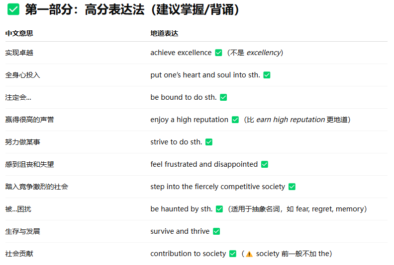
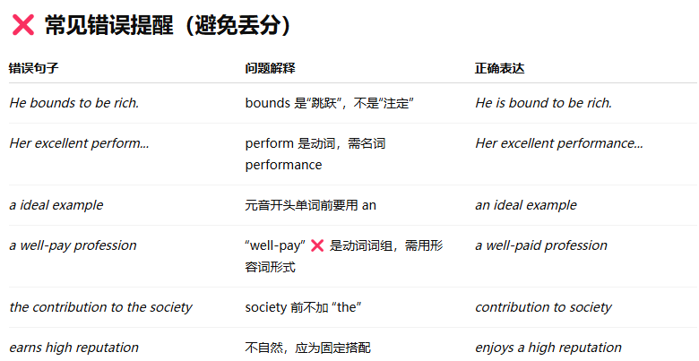
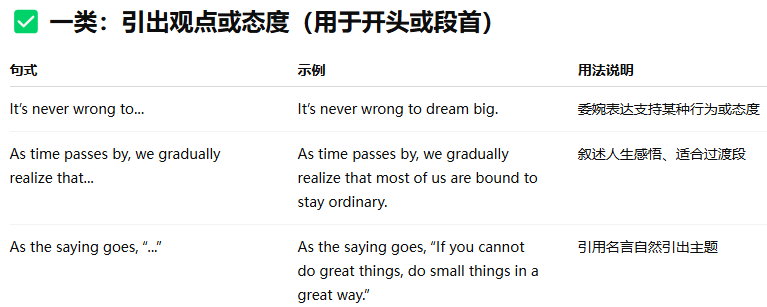
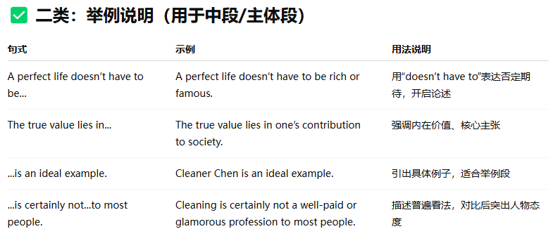
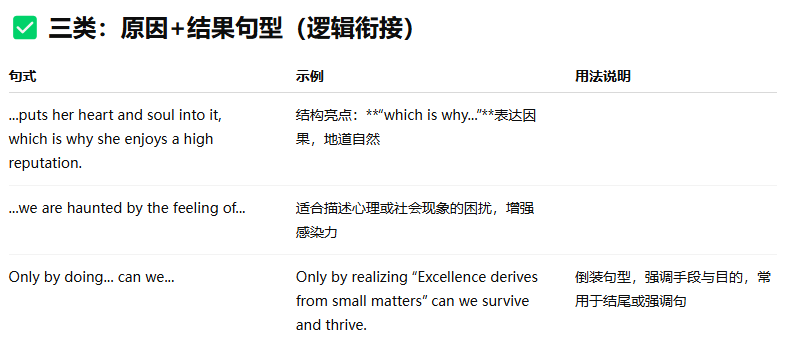

No. 1

Directions: For this part, you are allowed 30 minutes to write an essay commenting on the saying “If you cannot do great things, do small things in a great way．” You can cite examples to illustrate your point ofview. You should write at least 150 words but no more than 200 words.

* * *

We all remember a time when we spoke proudly about becoming the next Bill Gates or Stephen Hawking, and it’s never wrong to dream big. As time passes by, we gradually realize that most of us are bound to stay ordinary. Yet there’s still a way of achieving excellency. As the saying goes, “If you cannot do great things, do small things in a great way.”  
A perfect life doesn't have to be so glorious or sparkling as grand plays performed in theatres. The true value lies in one's contribution to the society. Cleaner Chen, who works in our community, is an ideal example. Cleaner is certainly not a well-pay or the brightest profession to most. Chen, however, puts her heart and soul into it and views it as his way of serving the community, which is why she earns high reputation.

As a generation about to step into the fiercely competitive society, we are haunted by the feeling of worry and helplessness. If we strive for accomplishing remarkable success and becoming world-renowned, we’ll probably feel frustrated and disappointed. Only by realizing “Excellency derives from small matters” can we survive and thrive.

* * *

**短语**

* * *

**句式**

## 🧠 小技巧总结：

- **which is why...**：表示结果，非常高级且自然

- **Only by doing... can we...**：强调手段+目的，写作亮点句型

- **The true value lies in...**：适合解释你的核心论点

- **...is certainly not...to most**：对比句型，适合正反论述

- **A is an ideal example**：简洁引例，适合考试时间紧张时使用
