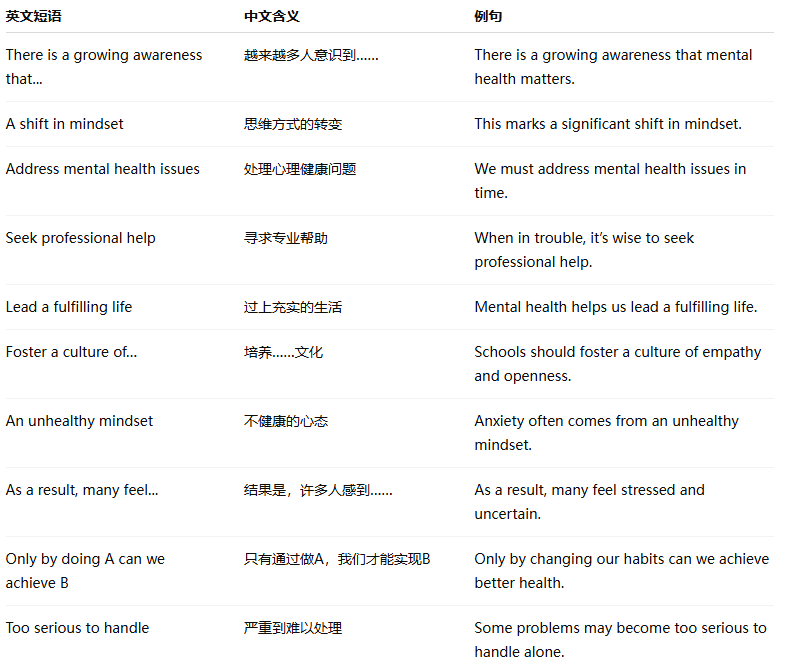
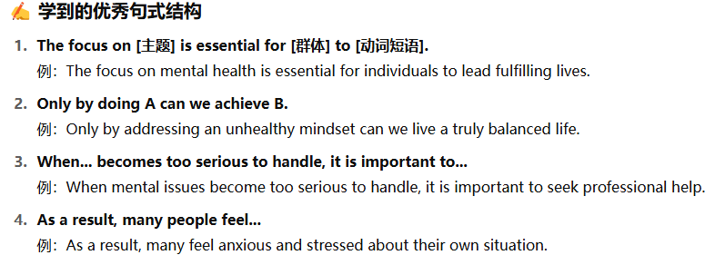
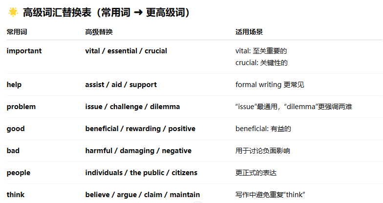

No.2

Directions : For this part, you are allowed 30 minutes to write an essay that begins with the sentence " Today there is a growing awareness that mental well-being needs to be given as much attention as physical health . "You can make comments , cite examples or use your personal experiences to develop your essay . You should write at least 150 words but no more than 200 words.

* * *

Today, there is a growing awareness that mental well-being needs to be given as much attention as physical health. This shift in mindset is pivotal in recognizing the interconnections of mental and physical health and acknowledging the significance of mental well-being in overall wellness. Addressing mental health issues is vital for a balanced and healthy life, and it is imperative to prioritize mental wellness alongside physical well-being.

The focus on mental health is essential for individuals to lead fulfilling lives. It is crucial to break taboos surrounding mental health, encourage open discussions, and increase access to mental health resources. Furthermore, promoting mindfulness, stress management, and seeking professional help when needed are crucial steps in ensuring mental well-being.

In conclusion, the acknowledgment of mental health as a cornerstone of overall wellness is a significant societal shift. It is imperative to continue advocating for mental health awareness, normalizing discussions around mental well-being, and investing in mental health resources. By prioritizing mental health alongside physical health, individuals and societies can foster a culture of holistic well-being and support for those struggling with mental health challenges.

* * *

