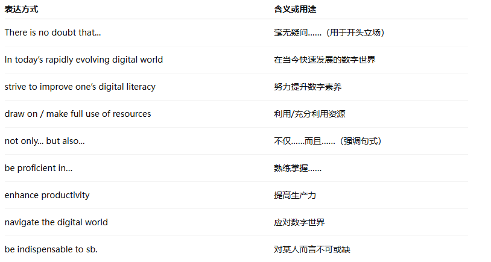
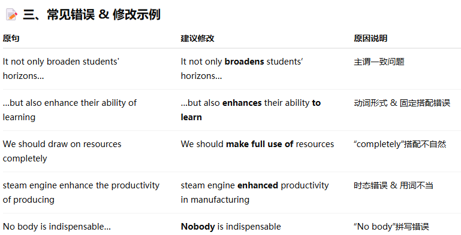
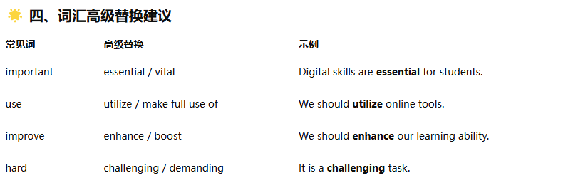

No.3

**Directions**:  
For this part, you are allowed 30 minutes to write an essay that begins with the sentence:  
**“There is a growing awareness of the importance of digital literacy and skills in today's world.”**  
You can make comments, cite examples or use your personal experiences to develop your essay.  
You should write at least **150 words** but no more than **200 words**.

### 📝 **范文：**

**There is a growing awareness of the importance of digital literacy and skills in today's world.**  
In today’s rapidly evolving digital world, I fully agree that digital literacy and skills are very important to everyone.

For one thing, it is obvious that digital literacy is crucial for students. There are a large number of learning resources available online, such as great theses and excellent courses from prestigious universities. Students can draw on these rich resources to learn more knowledge and expand their horizons.

For another, there is no denying that digital skills play an essential role in the workplace. We need to be proficient in using search engines to get more information and enhance our productivity with application software.

Moreover, we cannot live a better life without digital literacy and skills. They can help a lot when it comes to getting around, shopping, socializing, and so on.

To sum up, digital literacy and skills are of great importance to our study, work, and daily life. We should try our best to improve our digital literacy and skills to navigate the digital world.

* * *

