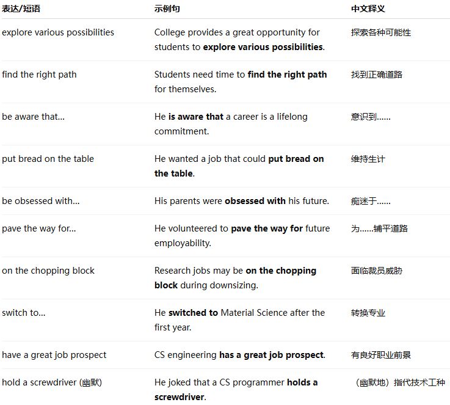
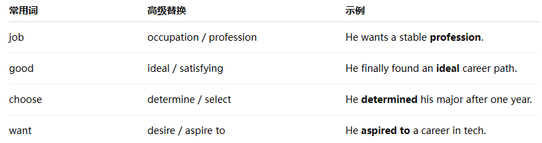
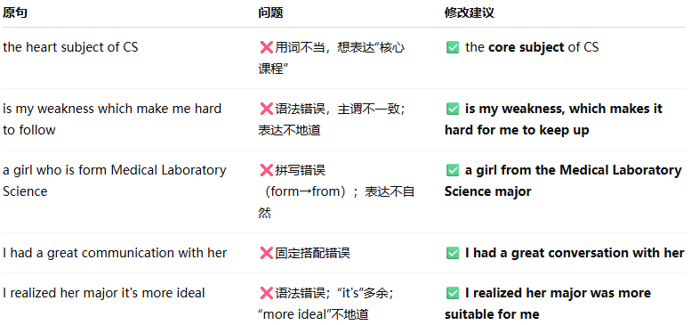

No.4

Direction: For this part, you are allowed 30 minutes to write an essay that begins with the sentence “College provides a great opportunity for students to explore various possibilities and find the right path for themselves.” You can make comments, cite examples or use your personal experiences to develop your essay. You should write at least 150 words but no more than 200 words.

* * *

College provides a great opportunity for students to explore various possibilities and find the right path for themselves.

Adam Lam, a Canadian student, has been doing quite well academically since he was little. He is aware that a career is a lifelong commitment. The problem was at an early age, he had difficulties identifying what major he wanted to pick at University of Toronto that he would enjoy and put bread on the table in the future.

Like the obsession of all Asians with the future of their children, Adam’s parents wanted Adam to be a medical doctor. Adam thought otherwise. He was revulsed at the idea that germ-infested patients would be spitting all over his face.

He chose biology in his first year of university and even volunteered to work at Toronto General Hospital to pave the way for employability as a researcher. His father jokingly asked if it would be fun watching bacteria mate in a lab all day long.

Adam switched to Material Science Engineering after the First Year. His father jested that maybe he could continue what Merlin, King Arthur’s magician, did by turning rocks into gold. The father was concerned that a research-oriented Material Science job would be the first on the chopping block in corporate downsizing.

Finally Adam determined that Computer Science Engineering would be what he liked best as a career with great job prospect. When asked by his father on what a Computer Science Engineer would be doing, he explained that it would be a Computer Science Programmer holding a screwdriver.

Good luck, Adam!

* * *

