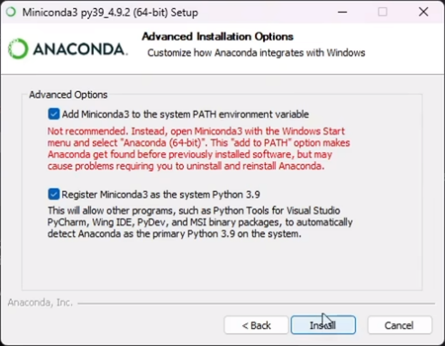

一、安装miniconda

<https://mirrors.tuna.tsinghua.edu.cn/anaconda/miniconda/Miniconda3-py39_4.9.2-Windows-x86_64.exe>



注意安装时选择D盘；两个选项都要勾选

安装完后cmd输入conda -V检查版本号

二、安装pycharm

```
https://download.jetbrains.com/python/pycharm-community-2024.3.exe?_gl=1*qlhwsa*_gcl_au*ODAzMDk1OTQ2LjE3NTIwNzI5MzA.*FPAU*ODAzMDk1OTQ2LjE3NTIwNzI5MzA.*_ga*MTg5MjQ4MjQ0NS4xNzUyMDcyOTMy*_ga_9J976DJZ68*czE3NTIwNzI5MzAkbzEkZzAkdDE3NTIwNzI5MzgkajUyJGwwJGgw
```

三、配置环境

（1）配置虚拟环境：

```
打开cmd
conda create -n yolo python==3.10.0
名字可以更改
```

（2）激活：conda activate yolo

```
（3）安装pytorch(依照CUDA版本)
```

```
cmd输入nvidia-smi查看
https://pytorch.org/get-started/previous-versions/
conda install pytorch==2.1.0 torchvision==0.16.0 torchaudio==2.1.0 pytorch-cuda=12.1 -c pytorch -c nvidia
```

（4）检查GUP是否可用

```
import torch
flag = torch.cuda.is_available()
print(f"GPU是否可用：{flag}")
device = torch.device("cuda:0" if torch.cuda.is_available() else "cpu")
print(device)
print(torch.cuda.get_device_name(0))
```


（4）下载Ultralytics


四、运行

（1）准备好数据文件

（2）创建一个data.yaml文件

```
train:C:/Users/WILL/Desktop/eggs_dataset/images/train
val: C:/Users/WILL/Desktop/eggs_dataset/images/val

nc: 2
names:
  0: egg
  1: edge
```

（3）Anaconda PowerShell Prompt中运行

```
conda activate yolov11
yolo train model=yolov11m.pt data="C:/Users/WILL/Desktop/eggs_dataset/data.yaml" epochs=200 imgsz=960 batch=4 device=0 name=eggs_v2

epochs训练次数
imgsz图片大小
batch单次训练图片量
device=0用GPU训练
name创建文件夹名称
```
