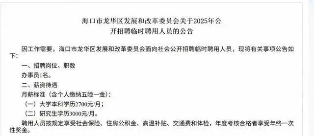
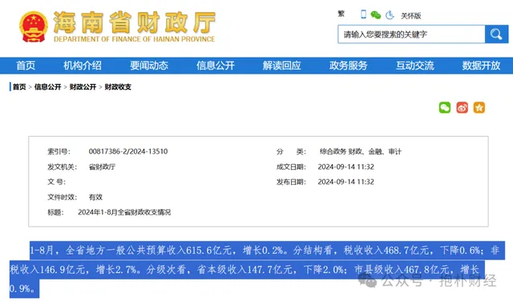
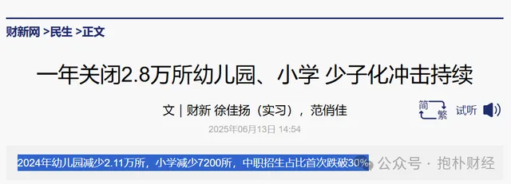
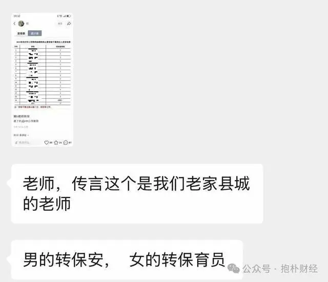

很多人的观念又要被颠覆了：是的，如果你只有学历，没有本事是挣不到钱。如果只有学历，不肯低头向下也是挣不到钱的。

**海南一事业单位招人，大学本科学历2700元/月，研究生学历3000元/月。**招聘方回应：按临聘人员标准定薪，有五险一金，与在编员工薪资标准不一样。

**胖东来招900人，保安保洁岗位要求“不超25岁+本科”，但是到手月薪近9000元高于同行。**

所以，是不是很难选？**本科毕业到底是去事业单位做临聘人员拿2700元，还是去胖东来拿9000元？**

新闻背后，一系列传统观念被摧枯拉朽般击溃，相关产业链也岌岌可危。

### **01 不要迷信任何铁饭碗**

8月11日，海南海口市龙华区发展和改革委员会发布了《海口市龙华区发展和改革委员会关于2025年公开招聘临时聘用人员的公告》。公告中的月薪标准（含个人缴纳五险一金）为：大学本科学历2700元/月，研究生学历3000元/月。该薪资引发不少网友讨论。

岗位虽然是临聘，但是单位还是很高大上的，可以满足一些人的情绪价值。

很多人在想的不是干一辈子临聘，而是考事业编、考公，这是最美好的结局。

可是，万一考不上呢？这个可能性极大，**现实中，绝大部分人考不上，然后临聘一辈子，低工资，沮丧都是常态。**

在我的老家，考公的录取比例是200:1，真的很难考上。

很多人就此质疑“读书无用”，在我看来，这是错的。

我始终认为读书有用，至少让你拥有一个基础条件，比如，**如果你不是本科，你连这个2700元月薪的工作的报考资格都没有。**

就算胖东来招保安保洁，也要本科起步。

**绝大部分家长、学生的思维方式都是固化的，都是刻舟求剑的**，他们希望孩子的人生路径是这样：

**读名校——考编——高福利高待遇——高退休金。**

可惜，这里面有一个变量不在你我的掌握之中，就是**单位到底有没有钱，或者单位能不能持续有钱。**

如果一个单位前20年有钱，后20年没钱，年轻人恰好在后20年一开始就跳上船，还以为是上岸，结果要过20年的“紧日子”甚至“苦日子”，可怎么整？

**学历有阶段性作用，单位不能保你一生平安富贵，只有你持续不断学本领，给讲实效的公司提供绩效，包括研发、销售绩效，你才能成为头部人物，才能持续高收入。**

海南海口市龙华区发展和改革委员会的在编人员的收入如何？我不知道。

但是，有些公开数据是可以看的。

2024年1—8月，全省地方一般公共预算收入615.6亿元，增长0.2%。分结构看，税收收入468.7亿元，下降0.6%。

至于海南2024年土地拍卖收入，我确实没有查到。

所以，临聘人员低工资是意料之中的，同时，我认为有编制的高收入也难以保证。

而且，不要认为有编制就稳了，《南方周末》报道——**生源少了，小学老师去教高中了。**

在临沂下辖的罗庄区、蒙阴县等多个区县，多位老师在即将开始的秋季学期，将离开自己所在的小学或初中，前往高中教书。在学龄人口变化的大背景下，有一个术语描述这种情况：**跨学段任教。**

原因很简单：**小学生的数量不够了，只能让他们去教高中。这对这些老师是痛苦的，因为教学压力太大。**

但是，小学生的数量继续跌，**如果高中也没法接受这些老师了，他们的编制还能保住？**

围绕学生的一系列产业链正在发生巨变，大家都懂，我们每天都在经历幼儿园、小学的关门——根据官方统计，**2024年关闭的小学和幼儿园数量约为2.83万所。**

所以，就算你拿到的是事业单位临聘，你觉得未来如何？

刚才，抱朴财经私享会的一位朋友告诉我：传言，他们老家县城的**一些老师转岗，男的转保安，女的转保育员。**

虽然是未经证实的传言，我觉得未来的趋势就是这样。

**所有人醒醒，不要迷信事业单位或者任何铁饭碗**，大家都在同一条船上，没有人上岸，除非你不在这片土地上。

**这很颠覆，但只是开始。**

### **02 “铁饭碗”来自持续赚钱的底气**

至于胖东来招900人，保安保洁要求“不超25岁+本科”，这也是真的，关键是工资很颠覆。

工作人员回应称，保安、保洁的招聘确实有学历要求，但同样胖东来保安保洁岗提供的薪资、福利等要高于同行。

胖东来大胖店的工作人员说：“**如果只是算基本工资，保洁、保安岗位缴纳社保后，到手月薪7000多元，但是再加上公司给的各种补贴，保洁、保安的月薪也差不多接近9000元。**”

所以，读书是有用的，本科是起步，如果能应聘到胖东来做保洁、保安，一个月9000元大洋，你敢说读书无用？

于东来给蓝领这么高的工资是好事，他告诉我们：**蓝领值得尊重，蓝领的收入可以超过某些欠发达地区的“铁饭碗”。**

你要知道，胖东来是在河南啊，你给一个保洁9000元的工资，你这不是颠覆是什么？

**胖东来给员工的每一分钱都是来自于自己的企业利润，不是分别人的蛋糕，而是自己做蛋糕分蛋糕。**

胖东来不过是告诉所有人：**靠商业的力量，靠勤奋和有效的工作，每一个人都可以获得幸福，每一个人都可以拥有尊严。**

人不必靠讨好他人来获得收入、利益，只需要认真工作就够了。

别以为这是小事，这是大事。

在河南这样的欠发达省份，给保安、保洁以高薪，甚至高过某些体制内人士，这就是巨浪造就的观念冲击波。

而且胖东来的经营状况很好，年营收已经超过百亿，**这种商业机构有价值观，有利润，其实它的工作岗位才是超稳定的“铁饭碗”。**

没错，有盈利能力的公司，持续规范运作的公司，走正道的公司才是“铁饭碗”的批量制造商，**这个“铁饭碗”来自于公司持续赚钱的底气。**

那些以本科学历进入胖东来的年轻人，绝大多数绝对不甘心干一辈子保洁、保安，他们可以在胖东来学习零售方面的商业知识，未来做一个中层或者大店的店长的可能性是存在的。

所以，我的总结是：

**这是一个颠覆的年代，学历依然有用，但个人的真本事才是机构、公司需要的，传统意义上的“铁饭碗”正在消融，商业力量塑造的“铁饭碗”正在批量生产中。**

永远要相信：

**只有个人的终身学习和商业机构的持续进化，才能给你持续的幸福和快乐，别的都不靠谱。**
