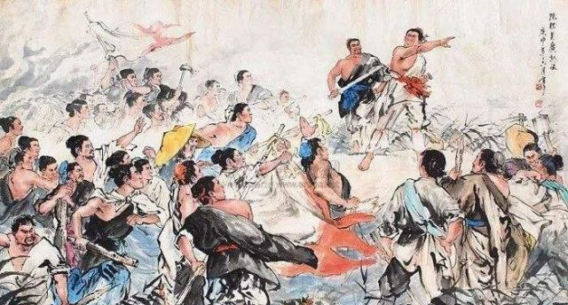
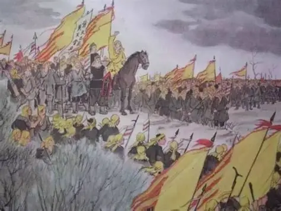
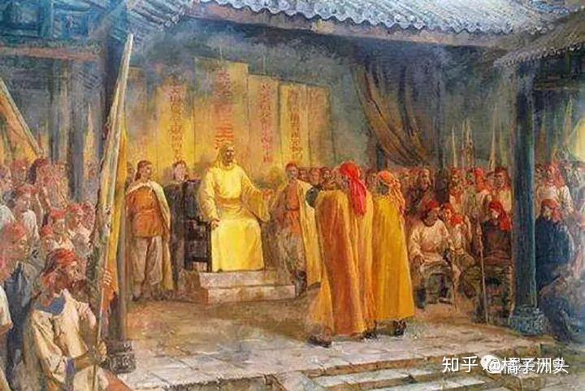

##### 一，

那一世，我叫陈胜。我还记得公元前209年那个大雨滂沱的下午：我看看天，像漏了一样，灰扑扑的雨柱倾泄而下，前途模糊；我看着地，每走一步，烂泥里都像伸出无数双手抓住脚踝，人们哭喊“死了，要死了”，有戍卒跌下山涧。

我们这900名戍卒是无法按期赶到渔阳了，即使走过这泥泞山路，最终也会走向铡刀，按大秦律，“失期者斩”……我看着连绵大雨，却想起那个骄阳似火的正午，我们被晒得头晕脑胀、皮肤皲裂，我说“苟富贵，勿相忘”。小伙伴们嘲笑：我们是佣耕，一寸土地都不拥有，还谈什么富贵，你小子被晒晕头了吧。我看着这些没理想的家伙，忽蹦出一句：燕雀安知鸿鹄之志。

那一世，我还不知道婆罗门这个说法，只知道在大秦，我们是贱民。大秦十户为“邻”，五邻为“里”，中间设有“闾门”，门左住着地位卑微、受压迫的贫民。所谓“发闾左，戍边渔阳”，就是让贱民上战场当人肉盾牌。

那天晚上我们围坐篝火烤着湿透的衣服，烤着从集市里买来的鱼，有人发出惊呼，剖开鱼肚赫然有根帛条，写着模糊的字……此时密林里传出一阵狐狸叫声，那声音越来越清晰，似为人语，大家听清，正是布条上字样：“大楚兴，陈胜王”。

军官骂“妖言惑众”，挥鞭就打。吴广一刀砍下他的头颅。从策划文案、把布条塞进鱼腹、让人藏在密林学狐叫，我只花了几个时辰。机不可失，我举着明晃晃的刀跳上一块大石，喊出那句传响了两千年的话：王侯将相宁有种乎！

误期是死，起义也是死，跟着我，兴许真能搏取一生富贵。那些贱民，不，我的阶级兄弟们举起各种明晃晃的武器跟着喊：王侯将相宁有种乎！

我们攻下陈县，天下响应。史书说：陈胜吴广起义是中国历史上第一次大规模有组织的农民起义，试图突破阶层壁垒，但内部纷争，各自为战……有一天吴广被杀。我正震惊，忽觉得背心一凉，转头看，庄贾拔出短剑，说：哥，我想明白了，要想阶层跨越，并不只有造反，还有一条路，背叛。

阶级兄弟是靠不住的。他砍下我的头颅献给秦军。我那颗头颅睁着眼，冷冷盯着世间，秦失其鹿，天下共逐之……最后是项羽和刘邦争霸，一个是贵族，一个基层官员，而我们这些纯种贱民失败了。

我不服，我还有下一世，王侯将相宁有种乎。

##### 二，

这一世，我叫王匡。

我父母未知，生平不详。自我出生便饥肠辘辘，形如土狗。我放眼乱世，等待时机，终于在一次大饥荒中揭竿而起，人们跟随我啸聚绿林山，就是“绿林军”，我是首领。

东方也有一支起义军，首领樊崇为了分清敌我就让将士染红眉毛，叫“赤眉军”。但我知道他其实想彰显贫民与贵族的形象不同，幼稚！贱民孤军作战，岂能成事。我汲取上一世教训，不能只靠阶级兄弟，还得有靠山。所以我和王凤拥立皇族刘玄为更始帝，恢复国号“汉”。刘秀的哥哥刘縯试图反对，被我果断杀死。刘秀并不敢反。

我运气甚好，不到七年时间就率大军攻入长安。那天，远远看见王莽站在未央宫高高的渐台上，作法换风水。我一个眼神，校尉冲上去就砍下这颗愚蠢的头颅，人们把头颅当球踢来踢去……王家九人封侯，五人做到大司马，风光无限，我要推翻他们；王莽新政就是祸害百姓，我要杀了他！

那是我人生鼎沸的时刻，刘玄封我为“比阳王”。我终于突破阶层固化，我赢了。

我很快发现不对，刘玄开始重用旧时贵族，排挤绿林赤眉军，甚至找个借口就杀掉农民军功臣。樊崇心生不满，另立宗室刘盆子为帝，率赤眉军围攻长安。此时刘玄对我起疑，杀掉我好几个兄弟……我心寒意冷，为求自保，投奔樊崇。

赤眉军攻破长安那天，刘玄光着上身乞降，他不再傲慢，也没机会傲慢了。赤眉大将谢禄取下大弓把他绞杀。我心中升起一丝爽意，却闻樊崇也要除掉我。我无路可走，投奔刘秀。

在安邑，刘秀的大将宗广骑在马上对我笑了笑，一刀就砍下我的头颅。我的头颅在地上滚了滚，那一刻我明白，宗室刘秀为了哥哥向我报仇。

我滚动的头颅，见远处刘秀的部队正剿杀赤眉军，樊崇率10万众投降；见刘秀攻下洛阳，贵族们竟各归旧位；我还见文人们在书房里夸刘秀才是真命天子，匡复汉室正统，而绿林、赤眉是祸民乱军；最终我看见，我为之血战的老百姓跪在扫得干干净净的道路两旁，迎接天神般向刘秀欢呼“吾皇万岁，万万岁”。那一刻我明白了，即使我找靠山、师出有名，但贱民就是贱民，改朝换代的斗争，贱民必须死。

我那颗头颅叹了口气，闭上眼。但我仍不服，我还有下一世。

##### 三，

我想了想，兄弟靠不住，靠山也靠不住，那就悬壶济世收服天下人心。 于是我创建“太平道”。 是的，这一世，我是张角。

我出身贫寒，曾游学求道，常以草药和符水为百姓治病。瘟疫四起，很多病人喝下符水立即痊愈，奉我为神明。但我令他们跪拜忏悔，只是做心理建设，草药也许有用，但人这动物，最需要精神安慰。所以我称得神人《太平清领书》，获大神通，加入“太平道”便能自救、救世。我发明一款口号：“苍天已死，黄天当立”，人们像参加摇滚音乐会一样手舞足蹈，流着热泪喊“岁在甲子，天下大吉”。

我的弟子遍布天下，四处宣扬我的神迹，信徒逾五十万，连郡县官员都未看出我的用心，反而认为我善于教化，让百姓纷纷归心。

其实我在策划“黄巾起义”。我将信徒分为三十六方，大方万余人，小方六七千，让人在官府墙上悄悄标记“甲子”作为攻打目标，还派人去宫里联络太监们作内应，约定三月五日里应外合，那一天，我将成为人上人……

却有弟子告发，事情败露。我提前起事，杀人祭天，率三十六万众头裹黄巾烧官府、杀豪强、劫安平王，史称“黄巾军起义”。天下响应，京师震动。卢植来了，刘备来了，董卓来了……但我一直胜利。

直到灵帝派来左中郎将皇甫嵩。他很能打。一直以治病救人闻名天下的我偶感风寒，在一个朝阳即起的早晨，咳血而亡。是夜皇甫嵩率部偷袭，斩杀黄巾军三万人，开棺戮尸砍下我的头，送到洛阳。

我又败了，如皮影戏一般轮回，我又看到烽烟四起，看到曹操、孙权、刘备勾心斗角、杀人无数，看到激动人心的赤壁大战，天下进入三国时代……但这与我无缘，我是失败的贱民。我总结：我有狂热的部众，有体制设计，卧底也能接近灵帝榻侧，我以为这次必能实现阶层突破，但我低估门阀世家的实力。天下不只属于皇帝，还属于弘农杨氏、颍川荀氏、太原王氏……笑到最后的是河内司马氏。

我转世四百年，似乎发现一个规律：出身卑微的我们，负责把天下搅乱，而世家大族负责收盘。

我仍不断转世，途经各种贱民起义：赵广起义，盖吴起义，六镇起义……贱民从未成功，却让一个个世家大族轮流掌权。本朝叫隋，执玺者杨广高大英俊、文彩飞扬却荒淫残暴，逼得天下大反，窦建德、刘霸道、杜伏威、瓦岗寨……但最后胜利属于世家大族的李渊、李世民。

对了，杨广与李渊都是西魏八柱国之一独孤信的外孙，他俩是表兄弟。我们搅得天下大乱，只是把那头鹿从杨家花园赶到李家花园。

我恨门阀世家，恨五姓七望，陇西李氏、清河崔氏、范阳卢氏、太原王氏……他们控制这个叫华夏的地方，潜移默化，无人能挡。只要门阀还在，贱民子弟永不翻身。

我不服，我还要转世……

##### 四，

看着白花花的盐，心中一动……耳畔响起老翁催父亲为菊花连句，父亲想不出。我忍不住答：“堪于百花为总首，自然天赐赭黄衣”。赭黄乃皇家专色，父亲怪我冒犯。老翁说“他能诗，但不知轻重，可令其再写一篇”。我答：“飒飒西风满院栽，蕊寒香冷蝶难来。他年我若为青帝，报与桃花一处开”。冲天之志，喷薄欲出。老翁和父亲怔怔盯着我。

那一年，我才五岁。

我叫黄巢，这一世不再是贱民，而幸运投胎商人之家。但我看到官家搜查私盐时，父亲总从围墙翻逃而去，那样子好像一条狗。还有一次他被五花大绑游街示众，衙役抽他大嘴巴，父亲两颊红肿，痛哭流涕……

开明的大唐也看不起商人，盐铁乃皇家专卖，民间抢生意，轻则游街，重则砍头。我没有富二代的风光，只有私盐贩子的恐慌。所以我要参加科举，当官！抽别人嘴巴！

我考到55岁才明白，李世民站在高高城头指着鱼贯而入的考生，笑谈“天下英雄入吾彀中”，是个骗局，科举仍被门阀世家把持。这一年，我又落榜了。长安红红的榜墙下，我看着鲜衣怒马的世家子弟金榜题名，簇拥而去，有股真气胸中激荡，脱口而出：“待到秋来九月八，我花开后百花杀，冲天香阵透长安，满城尽带黄金甲”。

科举给不了我的，刀剑能给我，考不进长安，我就杀进长安。我要造反！

我家有钱，从小善骑射，加之关东大旱，饥民如云，不到半年人马已过数万。我随王仙芝攻郓州、袭沂州、下淮南，十日破八县。我一拳打得欲招安的王仙芝脸颊流血，分道扬镳。后来我成了起义军领袖，称“冲天太保均平大将军”，之所以强调“均平”，因为《让子弹飞》说了：我要的就是公平，公平，还他妈的是公平！

我率部南渡，开山路七百里，进福建、攻广州，杀粤人，还杀胡商。胡商拿出很多钱赎命，也告诉了我一些外面的事。阿拉伯、印度，还有婆罗门、刹帝利、吠舍、首陀罗、贱民……我眼前打开了一扇透进热浪的窗，是的，华夏也分等级，我转世已久，即使投胎商人之家，还是成不了婆罗门。

我再次北上。士兵们不习岭南湿热天气，再就是我要杀进长安，杀光世家门阀，我就是婆罗门！

那天，梦想已久的画面终于成真——我乘黄金车逶迤向前，身后侍卫披长发、束红带、着锦袍，大将们乘铜车随后，几十万士兵浩浩荡荡从春明门进入京师。太极殿前，数千宫女跪迎称我“黄王”。我不许掳掠百姓，可杀红了眼的士兵哪分贵贱，那一场杀戮如镰刀割韭，那一场大火是末日烟花，按族谱一路杀过去，正是：“天街踏尽公卿骨，辕门遍挂权贵头”。

勤王部队纷纷赶来，我仓猝退出长安。军粮告罄，我就让士兵吃人肉，我才不管曾打着为黎民苍生的旗号造反，我是杀人魔王，杀，杀，杀！但实在打不过李克用，退至狼虎谷后，我知末日已至，便让外甥砍下我的头颅向唐军邀功，反正这头颅一千年来不断被砍掉、砍掉……

外甥捧着我的头颅一路走去，我也一路看去，我看到后人欢呼：哇，终于没有世家大族！

后面的事大家都知道，没有世家大族，皇帝更无忌惮，宋没有门阀，还有蔡京、秦桧，明没有五姓七望，却有几十万朱家后代吃空国库……贱民没出路，首陀罗、吠舍也没出路。

我那颗头颅不禁流下眼泪。

##### 五，

我出生时，我爹梦到一个黄衣人走进家门，所以我小名叫“黄来儿”；我父母双亡，自小被送入寺庙当小和尚，名黄来僧。这一点，倒跟本朝开国皇帝有些像。

我放过羊，后来考上驿站当差，再后被精简，刚回家，发现妻子韩金儿与盖虎通奸，我动了刀……只好投军。

这一世，我叫李自成。后面的事大家很清楚，不赘述，此处透露心路历程：和陈胜不同，他从小励志，“燕雀安知鸿鹄之志”；和张角也不同，他读书甚多，能制度设计，有组织狂热；和黄巢也不同，富二代想改变个人命运、改变世界。我历经转世，此次投胎早已想好：当一个温馨的小公务员，老婆孩子热炕头。

我率大军挺进北京时还给崇祯写信：封我为王、年赐百万银，帮他打女贞。他不同意……命运把我逼成“闯王”，可是我仍逃不过贱民造反的命数，作为农民的我竟在九宫山被另一个农民用锄头砸死，临死前，我忽想通一个道理：

朝代覆灭，不是因为出了反贼，而是朝代一直在制造反贼。

##### 六，

我看见在珠江游弋的英国军舰向清军开炮，岸边百姓木然围观，有小贩向英军叫卖水果，还有人为炮弹击中清军阵地哄然叫好……我身上好似电流通过。三年前落第的我生了一场大病，梦到老人赐我宝剑，让我诛妖。而此时，我看到洋人打得清军屁滚尿流。三年后，我将再次落第，梁发递了本《劝世良言》，我一读之下，醍醐灌顶：My God，上帝正是六年前我梦的那老人！

那股电流越来越强，嗖地穿透天灵盖直抵天庭，我听见上帝的声音：儿啊，去诛妖，去造反……我大声说：是的，父亲，我要造反。

这一世，我叫洪秀全，生于花县福源水村的农民家庭，屡试不第，郁郁寡欢，《劝世良言》让我找到阶层突破之路。我捣毁孔子牌位，换成上帝牌位，逢人便说我乃上帝次子，耶稣的弟弟。我请洋教士施洗。洋人竟说我对教义认识不足，拒绝了。这不重要，你不洗，我就自己洗。我的核心思想就是混搭：既是上帝次子，又以刘邦、朱元璋自居；反对孔子，又结合儒释道思想。逻辑漏洞不重要，教民们想不到这一层深度，他们只需简单易懂的口号，所以我说：上帝，是古今中外唯一真神，其他都是邪神。

我编写《原道救世歌》，唱“天下一家，共享太平”，成千上万贱民聚集到我身边…… 金田起义，攻克南京，改为天京。 我憎恨剥削，颁布《天朝田亩制度》，“有田同耕、有饭同食”，消灭地主，一切财物归公实行配给制。 我进行文化改造，斥“打躬叩首”为“妖礼”，婚礼从简，丧礼从简，去见上帝是高兴事，不准哭泣。 为避免浪费，我下令禁用棺木。

有人说，我有2300个美妃却要求士兵一夫一妻、男女分营……我是上帝二儿子，超级婆罗门，别用凡人要求我。

多年之后，毛泽东夸赞：洪秀全代表了我们出世之前向西方寻找真理的一派人物。

他说得对！

但内斗不断，天京将破，我竟食“甜露”中毒而亡。曾剃头焚烧我的尸体，把骨灰装进火炮，冲天发射，轰的一声，我他妈真成了天王。我在天上飞啊飞，看清我这贱民的一路来历：

我是陈胜，站在大石头上喊“王侯将相，宁有种乎”，被兄弟背刺。我是王匡，砍下王莽头颅，又被真正的贵族刘秀一刀砍下头颅。我是瓦岗群雄，只是把鹿从杨家花园赶到李家花园。我是黄巢，杀光门阀世家，卑贱的头仍被斫于狼虎谷。我是李自成，为农民“均田免粮”却死在农民锄下。我是洪秀全，挫骨扬灰……我这贱民转世两千年，一直进不了婆罗门。

我不服，我在天上飞啊飞……看到烧杀淫掠的义和团，看到火烧赵家楼的五四青年，看到井岗山“打土豪分田地”的赤卫队，看到延安的王实味不满阶层歧视，抱怨“衣分三色，食分五等”，被砍死、抛尸枯井。我还看到城楼上喊了一句“中国人民从此站起来了”，觉得自己并没站起来的遇罗克就写了《出身论》，被枪毙在北京工人体育场。我看到某个夏天，在广场高喊“反腐败，反官倒”的大学生身体被坦克倾轧，看到拎刀冲进警局的杨佳……前些时候，有个小伙讨薪800元不成便烧了工厂，说了《哪吒》台词：“我活不活无所谓，我只想让你死”……想多了，哪吒是官二代，你个拧锣丝的不配说这台词。

我转世已久，终于明白点什么：不是你有勇气和梦想就能阶层突破，那扇婆罗门前竖着一道横亘千年的高墙，等级制度早在设计之初便写进基因。有个叫费孝通的在《乡土中国》说“上升通道关闭，社会凝固如石”。有个叫梁启超的说“中国古今之患，常在贵贱不通”。有个叫钱穆的说中国一直是“血缘化治理”。中国式权力的秘密就是跟等级体系深度绑定，若想在城头占据一个位置，得用几代人的头颅来换，得妥协、跪舔、诡计多端、身心融合。所以根本没什么阶层突破，屠龙少年要么被吃掉，要么学贱民朱重八，他之所以唯一成功，因为他主动成为那条恶龙。

如今没有革命、没有起义，战场即考场，高考即科举，青灯夜读，悬梁刺股，但文凭永远比不过血缘证书。你看官场，官宦子女比例远超寒门，上品无寒门，下品无士族，士族有赋税减免，官员有特供、双轨制、高干病房，子女戴天价耳环、读哈佛大学，这是新的门阀制度。

门阀永不凋谢。你永远成不了婆罗门。
