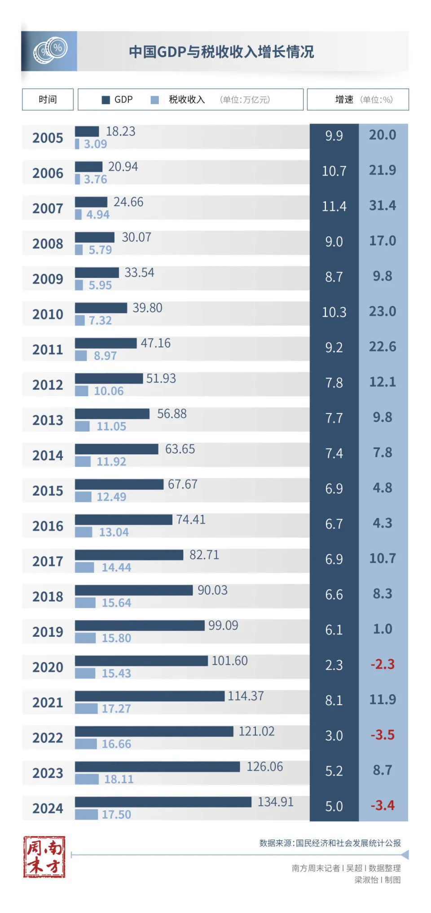

南方周末记者 吴超

在过去的二十年中，有三个年份，全国税收收入增速为负：2020年、2022年和2024年。

2025年上半年仍旧如此。

7月25日，财政部公布上半年财政收支情况：全国一般公共预算收入11.56万亿元，同比下降0.3%，其中全国税收收入9.29万亿元，同比下降1.2%。

然而，根据国家统计局数据，上半年全国GDP初步核算值为66万亿元，增长5.3%。

2024年，GDP增速为5.2%，税收收入同比下降3.4%。

为什么GDP在增长，税收收入反而在下降？

7月28日，国家税务总局局长胡静林在国新办举行的新闻发布会上介绍，“从税收与经济的协调性来看，经济决定税收，但也会有一些因素影响，造成经济与税收不完全同步。”

影响因素包括减税降费、价格变动、税源结构等，“剔除这些因素后，中国税收收入与GDP增速大体是匹配的。”

#### 现价与不变价的核算差异

中国的GDP总量通常是以现价计算的，而GDP增速，则是以不变价计算的。

现价，就是当时的价格。不变价，是以某年份现价作为基期，扣除价格变动因素后的价格，多用于计算与某个指定年份相比的增速。

计算GDP增速时，通常采用固定基期，基期每5年更换一次，如2021-2025年，GDP增速参考的是2020年的价格。

国内的经济指标，如GDP总量、税收收入、社会消费品零售总额等，都采用的是现价计算。

例如，2024年国民经济和社会发展统计公报介绍，全年GDP为134.9万亿元，社会消费品零售总额48万亿元。均为现价计算。

在一些研究报告里，也会见到名义GDP与实际GDP的表达。名义GDP，就是通过现价核算的，实际GDP则是通过不变价核算的。

总之，现价核算，就是没有剔除通胀影响；不变价，则剔除了。

这会带来多大变化呢？

以2014年，湖北省统计局官网的一则文章为例：某地2004年和2005年的GDP，按现价计算，分别为2918亿元、3327亿元，2005年的GDP增速是14%；以2000年为基期，按不变价计算，GDP分别为1511亿元、1680亿元，2005年的实际GDP增速是11.2%。

现价与不变价计算带来多大差异，要看价格水平的变化，也就是PPI（工业品出厂价格指数）。

#### PPI下滑拖累增值税

过去二十年里，多数年份的税收收入增速要高于GDP增速。特别是2005-2014年的十年间，税收收入增速均高于GDP增速。

“为什么每年财政收入会高于GDP的增长，就是因为价格因素，有些年价格因素影响比较多，有些年比较少。”2012年3月，时任财政部部长谢旭人在答记者问时介绍。

“话说回来，我们历史上也出现过财政收入增幅低于GDP增幅，就是通货紧缩，价格负增长。”他说。

反映价格变化的数据，PPI尤其重要，它是指产品出厂时的价格指标，反映企业生产成本的变化；CPI衡量消费端商品和服务价格的变动，反映居民的生活成本。

对于政府收入来说，PPI更重要。

2025年6月，《中国税务报》微信公众号的一则文章介绍，中国现行增值税、企业所得税等主要税种均按现价征收，受价格因素影响较大。自2022年10月以来，中国生产领域价格持续处于低位，PPI连续两年同比负增长，成为拖累税收收入增长的重要因素。

根据国家统计局数据，2025年上半年，PPI同比下降2.8%。

该文介绍，PPI持续下行直接压缩名义工业增加值的规模。名义工业增加值由实际工业增加值与工业品价格相乘得出，当工业品价格下降，即使实际产出保持稳定，名义工业增加值也会下滑。

增值税以名义增加值为税基，PPI回落，即价格水平下降，直接导致名义增加值缩水，随之增值税减少。

增值税与消费税、企业所得税、个人所得税并称为中国的四大税种。财政部数据显示，2025年上半年，增值税占税收收入比重为39%。

前述文章介绍，受PPI下行影响，2024年对增值税收入贡献较大的采矿业、石油煤炭及其他燃料加工业、黑色金属冶炼和压延加工业、非金属矿物制品业，营业收入分别下降5.2%、3.7%、6.2%和11.1%，制约了增值税收入增长。

以一个例子，来解释这种传导。

假如，一个服装加工厂以100元的不含税价格购入布料，加工后以200元的不含税价格卖出，增值税税率为13%，征收范围仅是增值额部分，即100元，因此增值税为13元。如不含税销售价格下滑至180元，增值税就是10.4元，下滑了20%。

“从过去10年看，PPI的增减会带来税收收入的同幅度增减。”胡静林在前述新闻发布会上解释，“可以说，这两年的税收受PPI影响是比较直接的。”

2025年1月，华创证券研究所副所长、首席宏观分析师张瑜撰文介绍，2011-2015年、2017-2020年、2021-2024年三轮典型价格下行期，税收对PPI的增速弹性分别为1.6、1.6、1.5。

换言之，PPI同比增速每下滑1%，税收收入同比增速下滑1.5%-1.6%。

张瑜进一步解释，增值税等于销项税额减去进项税额。PPI上行周期，其上涨带来的增收效果更明显。如果前几个月采购成本价格较低，进项税额相对少，而当月销售产品价格较高，销项税额相对多，增值税就会更高。反之，PPI处于下行周期，减收效果也更明显。

根据财政部数据，2024年增值税收入同比下降3.8%，是四大税种里增速最低的。

与此同时，PPI下滑会压缩工业企业的利润空间，进而拖累企业所得税的缴纳能力。

综合国家统计局和财政部数据，2025年上半年，全国规模以上工业企业利润下降1.8%，企业所得税同比下降1.9%。

#### 减税降费与收入承压

过去二十年里，2015-2016年、2019-2020年、2022年、2024年，税收收入增速低于GDP增速，原因大多与减税降费有关。

胡静林在前述新闻发布会上解释：“近年来我国减税降费力度较大，这对经济增长具有拉动作用，对长期税收也是有利的，但是会减少当期的税收收入。”

2015年，国内增值税3.1万亿元，同比增长0.8%。

财政部在当年财政收支情况中介绍，国内增值税主要受工业生产增速放缓、PPI下降以及前期扩大营改增范围，减税力度加大等因素影响。

2016年国务院政府工作报告中写道，“扩大结构性减税范围，实行普遍性降费。”将全面实施营改增（营业税改增值税），从5月1日起扩大试点范围，并确保所有行业税负只减不增。

“一带一路”税收征管合作机制秘书处发布的《中国税收营商环境改革发展研究报告（2016-2020）》介绍，2016-2020年，中国新增减税降费规模超过7.6万亿元。这个数字，相当于2020年全国税收收入的一半。

胡静林介绍，“十四五”时期（2021-2025），国家出台了一系列减税降费政策，“全国累计新增减税降费预计达到10.5万亿元，办理出口退税预计超过9万亿元。”

减税降费基础上，中国还面临着税源结构调整的问题，导致税收收入承压。

胡静林表示，对税收贡献相对较大的房地产等传统行业增速下降，带来相应税收增速放缓甚至减收。“新三样”（新能源汽车、锂电池、光伏产品）等新兴行业发展势头好，但是税收总体规模较小。

土地和房地产相关税收里，前两项通常是契税、土地增值税。根据财政部数据，2019年，这两项收入分别为6213亿元、6465亿元；2024年，分别是5170亿元、4869亿元，并仍在下滑。

另一方面，新能源汽车等产业仍享受着较多优惠政策，对税收增长的拉动作用还不够大。

2023年6月，国务院政策例行吹风会介绍，新能源汽车购置税减免政策将延长至2027年底。

时任财政部副部长许宏才在吹风会上介绍，2014年9月1日起，对购置新能源汽车免征车辆购置税。截至2022年底，上述政策累计免税规模超过2000亿元。“2024-2027年减免车辆购置税规模总额将达到5200亿元。”

税收收入增长受影响后，政府不得不通过增加非税收入以弥补缺口。

2024年，全国税收收入同比下降3.4%，非税收入同比增长25.4%。

财政部解释，主要是部分中央单位上缴专项收益和地方多渠道盘活资源资产，拉高非税收入增幅约24个百分点。
