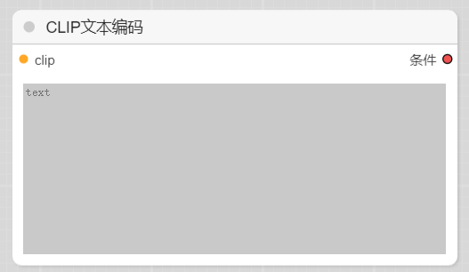
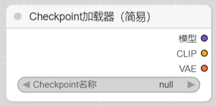
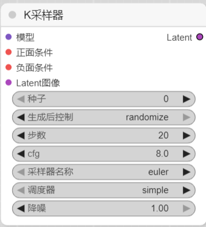
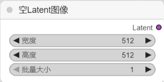
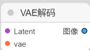
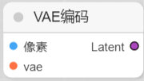
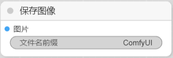
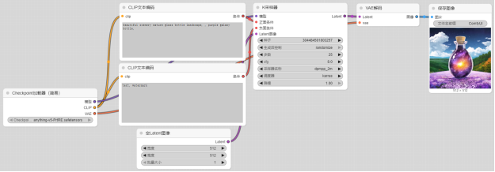

##### 1、CheckpointLoaderSimple

加载主模型（比如 sd1.5, sdxl）。输出包括：

model：送给 KSampler

clip：送给文本编码器

vae：送给 VAE 编码/解码

 

##### 2、CLIPTextEncode

把文字提示（Prompt / Negative Prompt）转成向量（conditioning），输入到 KSampler 控制画面内容。

##### 3、KSampler

采样器，核心的“出图引擎”。输入模型、Prompt、随机种子、迭代步数，输出 latent 图像。

⭐ 输入部分

模型 (model)：主模型（从 CheckpointLoaderSimple 输出的 model）。

正面条件 (positive cond)：正向 Prompt 的语义向量（CLIPTextEncode 输出）。

负面条件 (negative cond)：负面 Prompt 的语义向量。

Latent 图像 (latent)：输入的 latent 空间图像，可以来自 EmptyLatentImage（文生图）或 VAEEncode（图生图）。

⭐参数部分

①种子 (Seed)：控制随机数生成器。相同的 Prompt + 模型 + 种子 → 结果一致。0 或 -1 通常表示随机。固定数值可复现结果。

②生成后控制 (After control)：决定种子的使用方式：

randomize：每次运行随机种子。

fixed：始终使用固定值。

increment：每次运行种子自增 1（适合批量出图）。

③步数 (Steps)：采样迭代次数。步数越多，图像越细致、收敛度越高，但速度更慢。常用：20–30 步。太少会糊，太多可能过拟合或浪费算力。

④CFG (Classifier Free Guidance Scale)：简称提示词权重。数值越大，越贴近 Prompt，但容易僵硬、失真；数值低则更自由、随性。常用：7–9。10 容易画面崩。

⑤采样器名称 (Sampler)：控制“去噪”的算法，常见有：

euler / euler_a：收敛快，风格感强。

dpmpp_2m/dpmpp_2m_sde：**质量较高，常用**。

heun、lms：有不同细节表现，可试。

（不同算法影响图像风格/细节稳定性。）

⑥调度器 (Scheduler)：决定噪声在步数中分布方式。

simple：标准方案，速度快。

**karras**：更平滑，适合高步数。

exponential：强调早期噪声，风格差异明显。

⑦降噪 (Denoise strength)：只在图生图 / 重绘时有效。

0.0 → 不改动原图。

1.0 → 完全重绘。

0.3–0.6 → 常用范围，保留部分结构 + 加新细节。

##### 4、EmptyLatentImage

生成一个“空白画布 latent”，指定图片尺寸（宽、高、批量数量）。

##### 5、VAEDecode

把 latent 图像解码成可见的图片。

##### 6、VAEEncode

把一张图片压缩成 latent 图像（用于图生图）。

##### 7、SaveImage

保存最终图片到 ComfyUI/output/。

##### 将节点连接形成工作流

